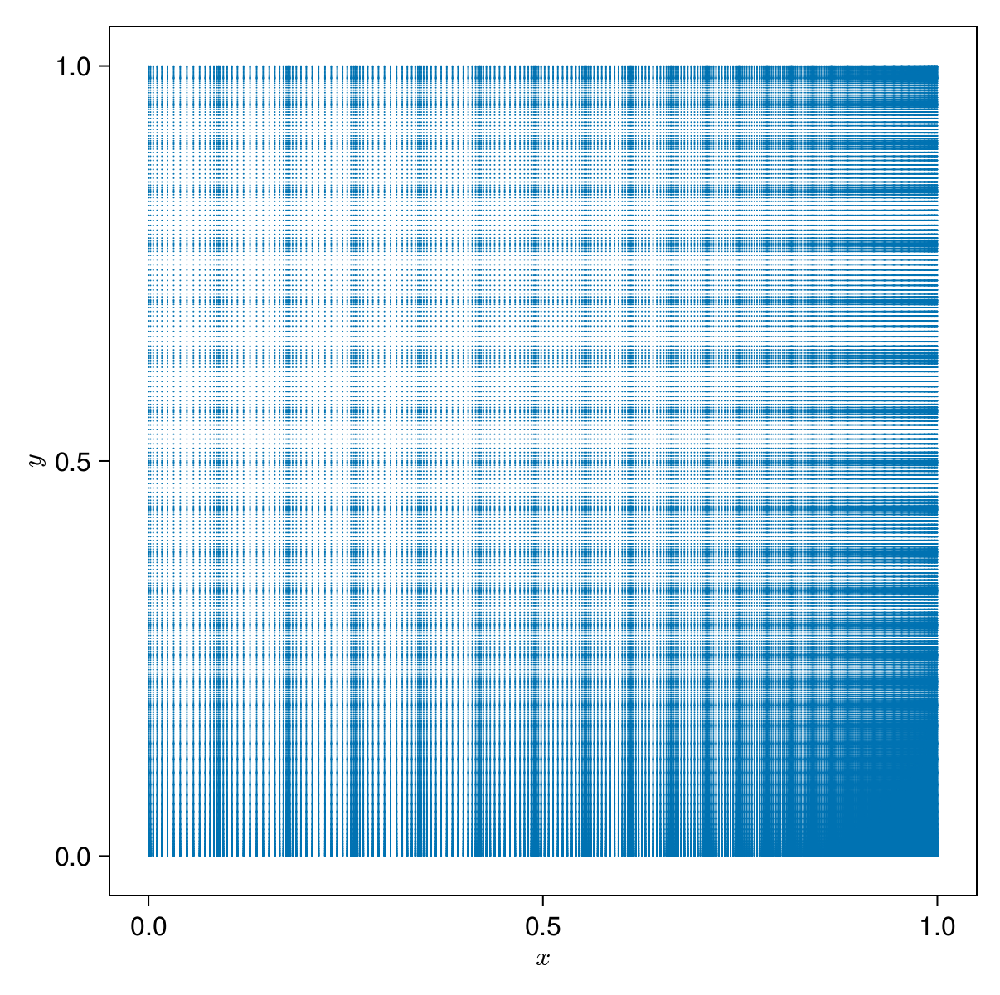

# [Introduction](@id guide)

We present `SparseIR.jl`, a Julia library for constructing and working with the intermediate representation of correlation functions [Shinaoka2017,Li2020,Shinaoka2022,Wallerberger2023](@cite).
The intermediate representation (IR) takes the matrix kernel occurring in transforming propagators between the real-frequency axis and the imaginary-time axis and performs a singular value expansion (SVE) on it, decomposing it into a set of singular values as well as two sets of functions.
One of those lives on the real-frequency axis and one on the imaginary-time axis.
Expressing a propagator in terms of either basis--by an ordinary least squares fit--then allows us to easily transition between them.
In combination with a prescription for constructing sparse sets of sampling points on each axis, we have a method for optimally compressing propagators.

`SparseIR.jl` implements the intermediate representation, providing on-the-fly computation of basis functions and singular values accurate to full precision along with routines for sparse sampling.
It is further fully unit tested, featuring near-complete code coverage.
Here, we will explain its inner workings by means of an example use case.
In preparing this document, `SparseIR.jl` version `1.0.18` and Julia version `1.11.1` were used.

## Problem statement
We take a problem to be solved from the `sparse-ir` paper [Wallerberger2023](@cite).
> Let us perform self-consistent second-order perturbation theory for the single impurity Anderson model at finite temperature.
> Its Hamiltonian is given by
> ```math
>     H = U c^\dagger_\uparrow c^\dagger_\downarrow c_\downarrow c_\uparrow + \sum_{p\sigma} \big(V_{p\sigma}  f_{p\sigma}^\dagger c_\sigma + V_{p\sigma}^* c_\sigma^\dagger f_{p\sigma}\big) + \sum_{p\sigma} \epsilon_{p} f_{p\sigma}^\dagger f_{p\sigma}
> ```
> where ``U`` is the electron interaction strength, ``c_\sigma`` annihilates an electron on the impurity, ``f_{p\sigma}`` annihilates an electron in the bath, ``\dagger`` denotes the Hermitian conjugate, ``p\in\mathbb R`` is bath momentum, and ``\sigma\in\{\uparrow, \downarrow\}`` is spin.
> The hybridization strength ``V_{p\sigma}`` and bath energies ``\epsilon_p`` are chosen such that the non-interacting density of states is semi-elliptic with a half-bandwidth of one, ``\rho_0(\omega) = \frac2\pi\sqrt{1-\omega^2}``, ``U=1.2``, ``\beta=10``, and the system is assumed to be half-filled.

## [Outline](@id outline)

To provide an overview, we first give the full code used to solve the problem with `SparseIR.jl`.
```julia
using SparseIR

β = 10.0; ωmax = 8.0; ε = 1e-6;

# Construct the IR basis and sparse sampling for fermionic propagators
basis = FiniteTempBasis{Fermionic}(β, ωmax, ε)
sτ = TauSampling(basis)
siω = MatsubaraSampling(basis; positive_only=true)

# Solve the single impurity Anderson model coupled to a bath with a
# semicircular density of states with unit half bandwidth.
U = 1.2
ρ₀(ω) = 2/π * √(1 - clamp(ω, -1, +1)^2)

# Compute the IR basis coefficients for the non-interacting propagator
ρ₀l = overlap.(basis.v, ρ₀)
G₀l = -basis.s .* ρ₀l

# Self-consistency loop: alternate between second-order expression for the
# self-energy and the Dyson equation until convergence.
Gl = copy(G₀l)
Σl = zero(Gl)
Gl_prev = zero(Gl)
G₀iω = evaluate(siω, G₀l)
while !isapprox(Gl, Gl_prev, rtol=ε)
    Gl_prev = copy(Gl)
    Gτ = evaluate(sτ, Gl)
    Στ = @. U^2 * Gτ^3
    Σl = fit(sτ, Στ)
    Σiω = evaluate(siω, Σl)
    Giω = @. (G₀iω^-1 - Σiω)^-1
    Gl = fit(siω, Giω)
end
```
Note that this script as presented is optimized for readability instead of performance; in practice, you would want to make minor adjustments to ensure maximum type inferrability and full type stability, among other things putting the code in a function instead of executing in global scope.
Such an performance-optimized version is provided in [Appendix: Optimized script](@ref optimized-script).
The following is a detailed explanation of what happens here under the hood and why.

# Treatment

If we take the second-order expression for the self-energy, which at half filling is simply 
```math
    \Sigma(\tau) = U^2 \pqty{G(\tau)}^3
```
and the Dyson equation
```math
    \hat G(\mathrm{i}\omega) = \pqty{\pqty{\hat G_0(\mathrm{i}\omega)}^{-1} - \hat\Sigma(\mathrm{i}\omega)}^{-1}
```
we have a system of two coupled equations.
The first one is diagonal in ``\tau`` and the second is diagonal in ``\mathrm{i}\omega``, so we need a way of converting efficiently between these two axes.

## Basis construction

We first import `SparseIR` and construct an appropriate basis.
To do so, we must first choose an appropriate UV frequency cutoff ``\omega_\mathrm{max}``, representing the maximum bandwidth our basis can capture.
The non-interacting density of states in our problem is semi-elliptic with half-bandwidth 1.
Once we introduce interactions via the interaction strength ``U``, this band splits into the lower and the upper Hubbard bands, centered around ``\omega = \pm U/2`` respectively.
So the bandwidth should be around ``3.2`` at a minimum, but we choose more than twice that with ``\omega_\mathrm{max} = 8`` to be safe.
```julia-repl
julia> using SparseIR

julia> β = 10.0; ωmax = 8.0; ε = 1e-6;

julia> basis = FiniteTempBasis{Fermionic}(β, ωmax, ε)
20-element FiniteTempBasis{Fermionic} with β = 10.0, ωmax = 8.0 and singular values:
 1.4409730317545617
 1.2153954454510802
 0.7652662478347486
 0.49740673945822533
 0.288562095623106
 0.1639819552743817
 0.08901271087151318
 0.046837974354297436
 0.023857653233506308
 0.01179373309602762
 0.005662400021411787
 0.0026427291749051072
 0.0011996720525663963
 0.0005299554043095754
 0.00022790287514550545
 9.544046906619884e-5
 3.8931895383167936e-5
 1.5472919567017398e-5
 5.992753725069063e-6
 2.2623276239584257e-6
```
There is quite a lot happening behind the scenes in this first innocuous-looking statement, so we will break it down:

### Kernel
Consider a propagator/Green's function defined on the imaginary-time axis
```math
    G(\tau) \equiv -\ev{T_\tau A(\tau) B(0)}
```
and the associated spectral function in real frequency ``\rho(\omega) = -(1/\pi) \;\mathrm{Im}\;G(\omega)``.
These are related via
```math
    G(\tau) = -\int_{-\omega_\mathrm{max}}^{+\omega_\mathrm{max}} \dd{\omega} \tilde K(\tau, \omega) \rho(\omega)
```
with the integral kernel
```math
    \tilde K(\tau, \omega) = \frac{e^{-\tau\omega}}{e^{-\beta\omega} + 1}
```
mediating between them.
If we perform an SVE on this kernel, yielding the decomposition
```math
    \tilde K(\tau, \omega) = \sum_{\ell=1}^\infty U_\ell(\tau) S_\ell V_\ell(\omega),
```
with the ``U_\ell``s and ``V_\ell``s each forming an orthonormal system, we can write
```math
    G(\tau) = \sum_{\ell=1}^\infty U_\ell(\tau) G_\ell = \sum_{\ell=1}^L U_\ell(\tau) G_\ell + \epsilon_{L+1}(\tau)
```
with expansion coefficients given by
```math
    G_\ell = -\int_{-\omega_\mathrm{max}}^{+\omega_\mathrm{max}} \dd{\omega}  S_\ell V_\ell(\omega) \rho(\omega).
```
The singular values decay at least exponentially quickly ``\log S_\ell = \order{-\ell / \log(\beta\omega_\mathrm{max})}``, so the error ``\epsilon_{L+1}(\tau)`` we incur by representing the Green's function in this way and cutting off the sum after ``L`` terms does too.
If we know its expansion coefficients, we can easily compute the propagator's Fourier transform by 
```math
    \hat G(\mathrm{i}\omega) = \int_0^\beta \dd{\tau} e^{\mathrm{i}\omega\tau} G(\tau) \approx \sum_{\ell=1}^L \hat U_\ell(\mathrm{i}\omega) G_\ell,
```
where ``\mathrm{i}\omega = (2n+1)\mathrm{i}\pi/\beta`` with ``n \in \mathbb Z`` is a Matsubara frequency.
The representation in terms of these expansion coefficients is what is called the intermediate representation and what `SparseIR.jl` is concerned with.

To standardize our variables, we define ``x \in [-1,+1]`` and ``y \in [-1,+1]`` by
```math 
    \tau = \beta (x+1)/2 \qand \omega = \omega_\mathrm{max} y
```
so that the kernel can be written
```math
    K(x, y) = \frac{e^{-\Lambda y (x + 1) / 2}}{e^{-\Lambda y} + 1},
```
with ``\Lambda = \beta\omega_\mathrm{max} = 80``.
This is represented by the object `LogisticKernel(80.0)`, which `FiniteTempBasis` uses internally.


### Singular value expansion

Central is the _singular value expansion_'s [Hansen2010](@cite) computation, which is handled by the function `SVEResult`:
Its purpose is to construct the decomposition
```math
    K(x, y) \approx \sum_{\ell = 0}^L U_\ell(x) S_\ell V_\ell(y)
```
where ``U_\ell(x)`` and ``V_\ell(y)`` are called ``K``'s left and right singular functions respectively and ``S_\ell`` are its singular values.
By construction, the singular functions form an orthonormal basis, i.e.
```math
    \int \dd{x} U_\ell(x) U_{\ell'}(x) = \delta_{\ell\ell'} = \int \dd{y} V_\ell(y) V_{\ell'}(y).
```
and thus above equation is equivalent to a pair of eigenvalue equations
```math
\left.
\begin{aligned}
    S_\ell U_\ell(x) &= \int \dd{y} K(x, y) V_\ell(y) \\
    S_\ell V_\ell(y) &= \int \dd{x} K(x, y) U_\ell(x)
\end{aligned}
\right\}
```
Here and in what follows, unless otherwise indicated, integrals are taken to be over the interval ``[-1,+1]`` (because we rescaled to ``x`` and ``y`` variables).

1. The function first calls the `choose_accuracy` helper and thereby sets the appropriate working precision.
   Because we did not specify a working accuracy ``\varepsilon^2``, it chooses for us machine precision `eps(Float64)`, i.e. ``\varepsilon \approx 2.2 \times 10^{-16}`` and working type `Float64x2` - a 128 bits floating point type provided by the MultiFloats.jl package - because in computing the SVD we incur a precision loss of about half our input bits, leaving us with full double accuracy results only if we use quad precision during the computation.

2. Then - by calling out to the `CentrosymmSVE` constructor - a support grid ``\{x_i\} \times \{y_j\}`` for the kernel to later be evaluated on is built.
   Along with these support points weights ``\{w_i\}`` and ``\{z_j\}`` are computed.
   These points and weights consist of repeated scaled Gauss integration rules, such that
   ```math
       \int \dd{x} f(x) \approx \sum_i f(x_i) w_i
       \quad\text{and}\quad
       \int \dd{y} g(y) \approx \sum_j g(y_j) z_j.
   ```
   To get an idea regarding the distribution of these sampling points, refer to following figure, which shows ``\{x_i\} \times \{y_j\}`` for ``\Lambda = 80``:
   
   
   #### Note:
   The points do not cover ``[-1, 1] \times [-1, 1]`` but only ``[0, 1] \times [0, 1]``.
   This is actually a special case as we exploit the kernel's centrosymmetry, i.e. ``K(x, y) = K(-x, -y)``.
   It is straightforward to show that the left/right singular vectors then can be chosen as either odd or even functions.

   Consequentially, we actually sample from a reduced kernel ``K^\mathrm{red}_\pm`` on ``[0, 1] \times [0, 1]`` that is given as either
   ```math
       K^\mathrm{red}_\pm(x, y) = K(x, y) \pm K(x, -y),
   ```
   gaining a 4-fold speedup (because we take only a quarter of the domain) in constructing the SVE.
   The full singular functions can be reconstructed by (anti-)symmetrically continuing them to the negative axis.
   ![The reduced kernels. Compare their [0,1] × [0,1] subregions with the sampling point distribution plot above.](assets/img/kernel_red.png)

   Using the integration rules allows us to approximate
   ```math
   \left.
   \begin{aligned}
       S_\ell U_\ell(x_i) &\approx \sum_j K(x_i, y_j) V_\ell(y_j) z_j &&\forall i \\
       S_\ell V_\ell(y_j) &\approx \sum_i K(x_i, y_j) U_\ell(x_i) w_i &&\forall j
   \end{aligned}
   \right\}
   ```
   which we now multiply by ``\sqrt{w_i}`` and ``\sqrt{z_j}`` respectively to normalize our basis functions, yielding
   ```math
   \left.
   \begin{aligned}
       S_\ell \sqrt{w_i} U_\ell(x_i) &\approx \sum_j \sqrt{w_i} K(x_i, y_j) \sqrt{z_j} \sqrt{z_j} V_\ell(y_j) \\
       S_\ell \sqrt{z_j} V_\ell(y_j) &\approx \sum_i \sqrt{w_i} K(x_i, y_j) \sqrt{z_j} \sqrt{w_i} U_\ell(x_i)
   \end{aligned}
   \right\}
   ```
   If we now define vectors ``\vec u_\ell``, ``\vec v_\ell`` and a matrix ``K`` with entries ``u_{\ell, i} \equiv \sqrt{w_i} U_\ell(x_i)``, ``v_{\ell, j} \equiv \sqrt{z_j} V_\ell(y_j)`` and ``K_{ij} \equiv \sqrt{w_i} K(x_i, y_j) \sqrt{z_j}``, then
   ```math
   \left.
   \begin{aligned}
       S_\ell u_{\ell, i} &\approx \sum_j K_{ij} v_{\ell, j} \\
       S_\ell v_{\ell, j} &\approx \sum_i K_{ij} u_{\ell, i}
   \end{aligned}
   \right\}
   ```
   or
   ```math
   \left.
   \begin{aligned}
       S_\ell \vec u_\ell &\approx K^{\phantom{\mathrm{T}}} \vec v_\ell \\
       S_\ell \vec v_\ell &\approx K^\mathrm{T} \vec u_\ell.
   \end{aligned}
   \right\}
   ```
   Together with the property ``\vec u_\ell^\mathrm{T} \vec u_{\ell'} \approx \delta_{\ell\ell'} \approx \vec v_\ell^\mathrm{T} \vec v_{\ell'}`` we have successfully translated the original SVE problem into an SVD, because
   ```math
       K = \sum_\ell S_\ell \vec u_\ell \vec v_\ell^\mathrm{T}.
   ```

3. The next step is calling the `matrices` function which computes the matrix ``K`` derived in the previous step.

   !!! note
       The function is named in the plural because in the centrosymmetric case it actually returns two matrices ``K_+`` and ``K_-``, one for the even and one for the odd kernel.
       The SVDs of these matrices are later concatenated, so for simplicity, we will refer to ``K`` from here on out.

   !!! info
       Special care is taken here to avoid FP-arithmetic cancellation around ``x = -1`` and ``x = +1``.

   ![Kernel matrices, rotated 90 degrees counterclockwise to make the connection with the (subregion [0,1] × [0,1] of the) previous figure more obvious. Thus we can see how the choice of sampling points has magnified and brought to the matrices' centers the regions of interest.
   Furthermore, elements with absolute values smaller than 10\% of the maximum have been omitted to emphasize the structure; this should however not be taken to mean that there is any sparsity to speak of we could exploit in the next step.](assets/img/kernel_red_matrices.png)

4. Take the truncated singular value decomposition (trSVD) of ``K``, or rather, of ``K_+`` and ``K_-``.
   We use here a custom trSVD routine written by Markus Wallerberger which combines a homemade rank-revealing QR decomposition with `GenericLinearAlgebra.svd!`.
   This is necessary because there is currently no trSVD for quad precision types available.

5. Via the function `truncate`, we throw away superfluous terms in our expansion.
   More specifically, we choose the basis size ``L`` such that ``S_\ell / S_0 > \varepsilon`` for all ``\ell \leq L``.
   Here ``\varepsilon`` is our selected precision, in our case it's equal to the double precision machine epsilon, ``2^{-52} \approx 2.22 \times 10^{-16}``.

6. Finally, we need a postprocessing step implemented in `postprocess` which performs some technical manipulation to turn the SVD result into the SVE we actually want.
   The functions are represented as piecewise Legendre polynomials, which model a function on the interval ``[x_\mathrm{min}, x_\mathrm{max}]`` as a set of segments on the intervals ``[a_i, a_{i+1}]``, where on each interval the function is expanded in scaled Legendre polynomials.
   The interval endpoints are chosen such that they reflect the approximate position of roots of a high-order singular function in ``x``.

### The finishing touches

The difficult part of constructing the `FiniteTempBasis` is now over.
Next we truncate the left and right singular functions by discarding ``U_\ell`` and ``V_\ell`` with indices ``\ell > L`` to match the ``S_\ell``.
The functions are now scaled to imaginary-time and frequency according to
```math
    \tau = \beta/2 (x + 1) \qand \omega = \omega_\mathrm{max} y
```
and to match them, the singular values are multiplied by ``\sqrt{(\beta/2)\omega}``, because ``K(x,y) \sqrt{\dd x\dd y} = K(\tau,\omega) \sqrt{\dd\tau\dd\omega}``.
We also add to our basis ``\hat{U}_\ell(\mathrm{i}\omega)``, the Fourier transforms of the left singular functions, defined on the fermionic Matsubara frequencies ``\mathrm{i}\omega = \mathrm{i}(2n+1)\beta/\pi`` (with integer ``n``).
This is particularly simple, because the Legendre polynomials' Fourier transforms are known analytically and given by spherical Bessel functions, for which we can rely on `Bessels.jl` [Helton2022](@cite).

We can now take a look at our basis functions to get a feel for them:


Looking back at the image of the kernel ``K(x,y)`` we can imagine how it is reconstructed by multiplying and summing (including a factor ``S_\ell``) ``U_\ell(\tau)`` and ``V_\ell(\omega)``.
An important property of the left singular functions is interlacing, i.e. ``U_\ell`` interlaces ``U_{\ell+1}``.
A function ``g`` with roots ``\alpha_{n-1} \leq \ldots \leq \alpha_1`` interlaces a function ``f`` with roots ``\beta_n \leq \ldots \leq \beta_1`` if
```math
    \beta_n \leq \alpha_{n-1} \leq \beta_{n-1} \leq \ldots \leq \beta_1.
```
We will use this property in constructing our sparse sampling set.


As for the Matsubara basis functions, we plot only the non-zero components, i.e. ``\mathrm{Im}\;\hat U_\ell\,(\mathrm{i}\omega)`` with odd ``\ell`` and  ``\mathrm{Re}\;\hat U_\ell\,(\mathrm{i}\omega)`` with even ``\ell``.

## Constructing the samplers

With our basis complete, we construct sparse sampling objects for fermionic propagators on the imaginary-time axis and on the Matsubara frequency axis.
```julia-repl
julia> sτ = TauSampling(basis);

julia> show(sampling_points(sτ))
[0.018885255323127792, 0.10059312563754808, 0.25218900406693556, 0.4822117319309194, 0.8042299148252774, 1.2376463941125326, 1.8067997157763205, 2.535059399842931, 3.4296355795122793, 4.45886851573216, 5.541131484267839, 6.570364420487721, 7.464940600157068, 8.19320028422368, 8.762353605887466, 9.195770085174722, 9.51778826806908, 9.747810995933065, 9.899406874362452, 9.981114744676873]

julia> siω = MatsubaraSampling(basis; positive_only=true);

julia> show(sampling_points(siω))
FermionicFreq[FermionicFreq(1), FermionicFreq(3), FermionicFreq(5), FermionicFreq(7), FermionicFreq(9), FermionicFreq(11), FermionicFreq(17), FermionicFreq(27), FermionicFreq(49), FermionicFreq(153)]
```
Both functions first determine a suitable set of sampling points on their respective axis.
In the case of `TauSampling`, the sampling points ``\{\tau_i\}`` are chosen as the extrema of the highest-order basis function in imaginary-time; this works because ``U_\ell`` has exactly ``\ell`` roots.
This turns out to be close to optimal with respect to conditioning for this size (within a few percent).
Similarly, `MatsubaraSampling` chooses sampling points ``\{\mathrm{i}\omega_n\}`` as the (discrete) extrema of the highest-order basis function in Matsubara.
By setting `positive_only=true`, one assumes that functions to be fitted are symmetric in
Matsubara frequency, i.e.
```math
    \hat G(\mathrm{i}\omega) = \qty(\hat G(-\mathrm{i}\omega))^*.
```
In this case, sparse sampling is performed over non-negative frequencies only, cutting away half of the necessary sampling space, so we get only 10 sampling points instead of the 20 in the imaginary-time case.

Then, both compute design matrices by ``E^\tau_{i\ell} = u_\ell(\tau_i)`` and ``E^\omega_{n\ell} = \hat{u}_\ell(i\omega_n)`` as well as their SVDs.
We are now able to get the IR basis coefficients of a function that is known on the imaginary-time sampling points by solving the fitting problem
```math
    G_\ell = \mathrm{arg\,min}_{G_\ell} \sum_{\{\tau_i\}} \norm{G(\tau_i) - \sum_\ell E^\tau_{i\ell} G_\ell}^2,
```
which can be done efficiently once the SVD is known.
The same can be done on the Matsubara axis
```math
    G_\ell = \mathrm{arg\,min}_{G_\ell} \sum_{\{\mathrm{i}\omega_n\}} \norm{\hat{G}(\mathrm{i}\omega_n) - \sum_\ell E^\omega_{n\ell} G_\ell}^2
```
and taken together we now have a way of moving efficiently between both.
In solving these problems, we need to take their conditioning into consideration; in the case of the Matsubara axis, the problem is somewhat worse conditioned than on the imaginary-time axis due to its discrete nature.
We augment it therefore with 4 additional sampling frequencies.


## Initializing the iteration

Because the non-interacting density of states is given ``\rho_0(\omega) = \frac{2}{\pi}\sqrt{1 - \omega^2}``, we can easily get the IR basis coefficients for the non-interacting propagator
```math
    {G_0}_\ell = -S_\ell {\rho_0}_\ell = -S_\ell \int \dd{\omega} V_\ell(\omega) \rho_0(\omega)
```
by utilizing the `overlap` function, which implements integration.
```julia-repl
julia> U = 1.2
1.2

julia> ρ₀(ω) = 2/π * √(1 - clamp(ω, -1, +1)^2)
ρ₀ (generic function with 1 method)

julia> ρ₀l = overlap.(basis.v, ρ₀)
20-element Vector{Float64}:
  0.601244316541724
  1.3444106938820255e-17
 -0.3114509472896204
  ⋮
 -4.553649124439119e-18
 -0.04700635138837371
  1.734723475976807e-18

julia> G₀l = -basis.s .* ρ₀l
20-element Vector{Float64}:
 -0.8663768456323275
 -1.6339906341599403e-17
  0.23834289781690587
  ⋮
  7.045824663886568e-23
  2.816974873845819e-7
 -3.924512839631511e-24
```
The coefficients of the full Green's function are then initialized with those of the non-interacting one.
Also, we will need the non-interacting propagator in Matsubara for the Dyson equation, so we `evaluate` with the `MatsubaraSampling` object created before.
```julia-repl
julia> Gl = copy(G₀l)
20-element Vector{Float64}:
 -0.8663768456323275
 -1.6339906341599403e-17
  ⋮
  2.816974873845819e-7
 -3.924512839631511e-24

julia> Σl = zero(Gl)
20-element Vector{ComplexF64}:
 0.0 + 0.0im
 0.0 + 0.0im
     ⋮
 0.0 + 0.0im
 0.0 + 0.0im

julia> Gl_prev = zero(Gl)
20-element Vector{Float64}:
 0.0
 0.0
 ⋮
 0.0
 0.0

julia> G₀iω = evaluate(siω, G₀l)
10-element Vector{ComplexF64}:
 1.0546844383198476e-16 - 1.468055523701327im
 1.6747120525708993e-16 - 0.8633270688082162im
                        ⋮
  1.627612150170272e-17 - 0.06489281188294724im
  6.134766817544449e-19 - 0.020802317001514643im
```

## Self-consistency loop

We are now ready to tackle the coupled equations from the start, and will state them here for the reader's convenience:
```math
    \Sigma(\tau) = U^2 \pqty{G(\tau)}^3
```
and the Dyson equation
```math
    \hat G(\mathrm{i}\omega) = \pqty{\pqty{\hat G_0(\mathrm{i}\omega)}^{-1} - \hat\Sigma(\mathrm{i}\omega)}^{-1}.
```
The first one is diagonal in ``\tau`` and the second is diagonal in ``\mathrm{i}\omega``, so we employ the IR basis to efficiently convert between the two bases.
Starting with our approximation to ``G_\ell`` we evaluate in the ``\tau``-basis to get ``G(\tau)``, from which we can compute the self-energy on the sampling points ``\Sigma(\tau)`` according to the first equation.
This can now be fitted to the ``\tau``-basis to get ``\Sigma_\ell``, and from there ``\hat\Sigma(\mathrm{i}\omega)`` via evaluation in the ``\mathrm{i}\omega``-basis.
Now the Dyson equation is used to get ``\hat G(\mathrm{i}\omega)`` on the sampling frequencies, which is then fitted to the ``\mathrm{i}\omega``-basis yielding ``G_\ell`` and completing the loop.
This is now performed until convergence.
```julia-repl
julia> while !isapprox(Gl, Gl_prev, rtol=ε)
           Gl_prev = copy(Gl)
           Gτ = evaluate(sτ, Gl)
           Στ = @. U^2 * Gτ^3
           Σl = fit(sτ, Στ)
           Σiω = evaluate(siω, Σl)
           Giω = @. (G₀iω^-1 - Σiω)^-1
           Gl = fit(siω, Giω)
       end
```
This is what one iteration looks like spelled out in equations:
```math
\begin{aligned}
    G^\mathrm{prev}_\ell &= G_\ell \\
    G(\tau_i) &= \sum_\ell U_\ell(\tau_i) G_\ell \\
    \Sigma(\tau_i) &= U^2 \pqty{G(\tau_i)}^3 \\
    \Sigma_\ell &= \mathrm{arg\,min}_{\Sigma_\ell} \sum_{\{\tau_i\}} \norm{\Sigma(\tau_i) - \sum_\ell U_\ell(\tau_i) \Sigma_\ell}^2 \\
    \hat\Sigma(\mathrm{i}\omega_n) &= \sum_\ell \hat U_\ell(\mathrm{i}\omega_n) \Sigma_\ell \\
    \hat G(\mathrm{i}\omega_n) &= \pqty{\pqty{\hat G_0(\mathrm{i}\omega_n)}^{-1} - \hat\Sigma(\mathrm{i}\omega_n)}^{-1} \\
    G_\ell &= \mathrm{arg\,min}_{G_\ell} \sum_{\{\mathrm{i}\omega_n\}} \norm{\hat G(\mathrm{i}\omega_n) - \sum_\ell \hat U_\ell(\mathrm{i}\omega_n) G_\ell}^2
\end{aligned}
```
We consider the iteration converged when the difference between subsequent iterations does not exceed the basis accuracy, i.e. when
```math
    \norm{G_\ell - G^\mathrm{prev}_\ell} \leq \varepsilon \max\Bqty{\norm{G_\ell}, \norm{G^\mathrm{prev}_\ell}},
```
where the norm is ``\norm{G_\ell}^2 = \sum_{\ell=1}^L G_\ell^2``.

The entire script, as presented in [Appendix: Optimized script](@ref optimized-script), takes around 60ms to run and allocates roughly 19MiB on a laptop CPU from 2019.

## Visualizing the solution

To plot our solution for the self-energy, we create a `MatsubaraSampling` object on a dense box of sampling frequencies.
In this case, we only need it for expanding, i.e. multiplying a vector, hence there is no need for constructing the SVD, so we pass `factorize=false`.
```julia-repl
julia> box = FermionicFreq.(1:2:79)
40-element Vector{FermionicFreq}:
  π/β
  3π/β
                 ⋮
 77π/β
 79π/β

julia> siω_box = MatsubaraSampling(basis; sampling_points=box, factorize=false);

julia> Σiω_box = evaluate(siω_box, Σl)
40-element Vector{ComplexF64}:
 -6.067770915322836e-17 - 0.09325923974719101im
 2.0279596075077236e-17 - 0.1225916020773678im
                        ⋮
 -6.624594477591435e-17 - 0.014786512975659354im
  -7.08391512971528e-17 - 0.01441676347590391im
```
We are now in a position to visualize the results of our calculation:
- In the main plot, the imaginary part of the self-energy in Matsubara alongside the sampling points on which it was computed.
  This illustrates very nicely one of the main advantages of our method: During the entire course of the iteration we only ever need to store and calculate with the values of all functions on the sparse set of sampling points and are still able to expand the result the a dense frequency set in the end.
- In the inset, the IR basis coefficients of the self-energy and of the propagator, along with the basis singular values.
  We only plot the non-vanishing basis coefficients, which are those at odd values of ``\ell`` because the real parts of ``\hat G(\mathrm{i}\omega)`` and ``\hat \Sigma(\mathrm{i}\omega)`` are almost zero.
  The singular values ``S_\ell/S_1`` are the bound for ``\abs{G_l / G_1}`` and ``\abs{\Sigma_\ell / \Sigma_1}``.


# Summary and outlook

We introduced `SparseIR.jl`, a full featured implementation of the intermediate representation in the Julia programming language.
By means of a worked example, we explained in detail how to use it and the way it works internally.
In this example, we solved an Anderson impurity model with elliptical density of states to second order via a self-consistent loop.
We successfully obtained the self-energy (accurate to second order) with minimal computational effort.

Regarding further work, perhaps the single most obvious direction is the extension to multi-particle quantities; And indeed, [Shinaoka2018,Wallerberger2021](@cite) did exactly this, with Markus Wallerberger writing the as of yet unpublished Julia library `OvercompleteIR.jl` which builds on top of `SparseIR.jl`.
This library has already found applications in solving the parquet equations for the Hubbard model and for the Anderson impurity model [Michalek2024](@cite).

# References

```@bibliography
```

# [Appendix: Optimized script](@id optimized-script)
With minimal modifications we can transform our code to be more optimized for performance:
- Put script in a function. This is because globals are type instable in Julia.
- Add `::Vector{Float64}` annotation to ensure type inferrability of `ρ₀l`.
- `Gl` in the loop will be a `Vector{ComplexF64}` in the loop, so make it `complex` right away for type stability.
- Preallocate and reuse arrays to remove allocations in the loop, minimizing total allocations and time spent garbage collecting. Here we benefit from `SparseIR.jl` providing in-place variants `fit!` and `evaluate!`.
```julia
using SparseIR

function main(; β=10.0, ωmax=8.0, ε=1e-6)
    # Construct the IR basis and sparse sampling for fermionic propagators
    basis = FiniteTempBasis{Fermionic}(β, ωmax, ε)
    sτ = TauSampling(basis)
    siω = MatsubaraSampling(basis; positive_only=true)

    # Solve the single impurity Anderson model coupled to a bath with a
    # semicircular density of states with unit half bandwidth.
    U = 1.2
    ρ₀(ω) = 2 / π * √(1 - clamp(ω, -1, +1)^2)

    # Compute the IR basis coefficients for the non-interacting propagator
    ρ₀l = overlap.(basis.v, ρ₀)::Vector{Float64}
    G₀l = -basis.s .* ρ₀l

    # Self-consistency loop: alternate between second-order expression for the
    # self-energy and the Dyson equation until convergence.
    Gl = complex(G₀l)
    G₀iω = evaluate(siω, G₀l)

    # Preallocate arrays for the self-energy and the Green's function
    Σl = similar(Gl)
    Στ = similar(Gl, ComplexF64, length(sampling_points(sτ)))
    Σiω = similar(G₀iω)
    Gτ = similar(Στ)
    Giω = similar(G₀iω)

    Gl_prev = zero(Gl)
    while !isapprox(Gl, Gl_prev, rtol=ε)
        Gl_prev .= Gl
        evaluate!(Gτ, sτ, Gl)
        @. Στ = U^2 * Gτ^3
        fit!(Σl, sτ, Στ)
        evaluate!(Σiω, siω, Σl)
        @. Giω = (G₀iω^-1 - Σiω)^-1
        fit!(Gl, siω, Giω)
    end
    return basis, Σl
end
```
