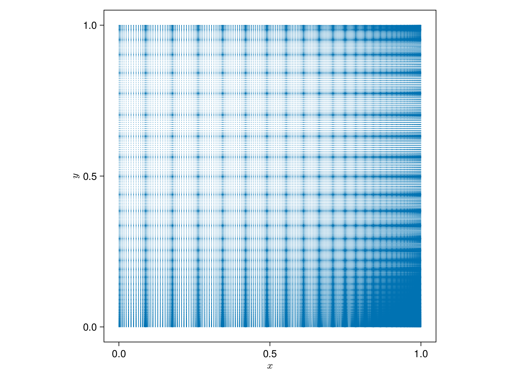

# Example usage and detailed explanation

We will explain the inner workings of `SparseIR.jl` by means of an example use case, adapted from the [`sparse-ir` paper](https://arxiv.org/abs/2206.11762).

## Problem statement

> Let us perform self-consistent second-order perturbation theory for the single impurity Anderson model at finite temperature.
> Its Hamiltonian is given by
> ```math
>     H = U c^\dagger_\uparrow c^\dagger_\downarrow c_\downarrow c_\uparrow + \sum_{p\sigma} \big(V_{p\sigma}  f_{p\sigma}^\dagger c_\sigma + V_{p\sigma}^* c_\sigma^\dagger c_\sigma^\dagger\big) + \sum_{p\sigma} \epsilon_{p} f_{p\sigma}^\dagger f_{p\sigma}
> ```
> where ``U`` is the electron interaction strength, ``c_\sigma`` annihilates an electron on the impurity, ``f_{p\sigma}`` annihilates an electron in the bath, ``\dagger`` denotes the Hermitian conjugate, ``p\in\mathbb R`` is bath momentum, and ``\sigma\in\{\uparrow, \downarrow\}`` is spin.
> The hybridization strength ``V_{p\sigma}`` and bath energies ``\epsilon_p`` are chosen such that the non-interacting density of states is semi-elliptic with a half-bandwidth of one, ``\rho_0(\omega) = \frac2\pi\sqrt{1-\omega^2}``, ``U=1.2``, ``\beta=10``, and the system is assumed to be half-filled.

## Treatment

We first import `SparseIR` and construct an appropriate basis (``\omega_\mathrm{max} = 8`` should be more than enough for this example):
```julia-repl
julia> using SparseIR

julia> basis = FiniteTempBasis(fermion, 10, 8)
FiniteTempBasis{LogisticKernel, Float64}(fermion, 10.0, 8.0)
```
There's quite a lot happening behind the scenes in this first innocuous-looking statement, so let's break it down:
Because we did not specify otherwise, the constructor chose the analytic continuation kernel for fermions, `LogisticKernel(80.0)`, defined by
```math
\begin{equation}
    K(x, y) = \frac{e^{-Λ y (x + 1) / 2}}{1 + e^{-Λ y}},
\end{equation}
```
for us, where 80.0 is the value of the scale parameter ``\Lambda = \beta\omega_\mathrm{max}``.

### SVE

Central is the _singular value expansion_'s (SVE) computation, which is handled by the function `compute_sve`:
Its purpose is constructing the decomposition
```math
\begin{equation}
    K(x, y) \approx \sum_{\ell = 0}^L U_\ell(x) S_\ell V_\ell(y)
\end{equation}
```
where ``U_\ell(x)`` and ``V_\ell(y)`` are called ``K``'s left and right singular functions respectively and ``S_\ell`` are its singular values.
The singular functions are form an orthonormal basis by construction, i.e.
```math
\begin{equation}
    \int \dd{x} U_\ell(x) U_{\ell'}(x) = \delta_{\ell\ell'} = \int \dd{y} V_\ell(y) V_{\ell'}(y).
\end{equation}
```
and thus
```math
\begin{equation} \label{coeff1}
\left.
\begin{aligned}
    S_\ell U_\ell(x) &= \int \dd{y} K(x, y) V_\ell(y) \\
    S_\ell V_\ell(y) &= \int \dd{x} K(x, y) U_\ell(x)
\end{aligned}
\right\}
\end{equation}
```
Here and in what follows, unless otherwise indicated, integrals are taken to be over the interval ``[-1,1]``.

1. The function first calls the `_choose_accuracy` helper and thereby sets the appropriate working precision.
   Because we did not specify a working accuracy ``\varepsilon``, it chooses for us ``\varepsilon \approx 2.2 \times 10^{-16}`` and working type `Float64x2` - a 128 bits floating point type provided by the MultiFloats.jl package - because in computing the SVD we incur a precision loss of about half our input bits, leaving us with full double accuracy results only if we use quad precision during the computation.

2. Then - by calling out to the `CentrosymmSVE` constructor - a support grid ``\{x_i\} \times \{y_j\}`` the kernel will later be evaluated on is built.
   Along with these support points weights ``\{w_i\}`` and ``\{z_j\}`` are computed.
   These points and weights consist of repeated scaled Gauss integration rules, such that
   ```math
   \begin{equation} \label{intrules}
       \int \dd{x} f(x) \approx \sum_i f(x_i) w_i
       \quad\text{and}\quad
       \int \dd{y} g(y) \approx \sum_j g(y_j) z_j.
   \end{equation}
   ```
   To get an idea regarding the distribution of these sampling points, refer to following figure, which shows ``\{x_i\} \times \{y_j\}`` for ``\Lambda = 80``:
   
   
   
   !!! note
       Note that the points do not cover ``[-1, 1] × [-1, 1]`` but only ``[0, 1] × [0, 1]``.
       This is actually a special case as we exploit the kernel's centrosymmetry, i.e. ``K(x, y) = K(-x, -y)``.
       It is straightforward to show that the left/right singular vectors then can be chosen as either odd or even functions.
    
       Consequentially, they are singular functions of a reduced kernel ``K_\mathrm{red}`` on ``[0, 1] × [0, 1]`` that is given as either:
       ```math
       \begin{equation}
           K_\mathrm{red}(x, y) = K(x, y) \pm K(x, -y)
       \end{equation}
       ```
       It is these reduced kernels we will actually sample from, gaining a 4-fold speedup in constructing the SVE.

   Using the integration rules \eqref{intrules} allows us to approximate \eqref{coeff1} by
   ```math
   \begin{equation} \label{coeff2}
   \left.
   \begin{aligned}
       S_\ell U_\ell(x_i) &\approx \sum_j K(x_i, y_j) V_\ell(y_j) z_j &&\forall i \\
       S_\ell V_\ell(y_j) &\approx \sum_i K(x_i, y_j) U_\ell(x_i) w_i &&\forall j
   \end{aligned}
   \right\}
   \end{equation}
   ```
   which we now multiply by ``\sqrt{w_i}`` and ``\sqrt{z_j}`` respectively, yielding
   ```math
   \begin{equation} \label{coeff3}
   \left.
   \begin{aligned}
       S_\ell \sqrt{w_i} U_\ell(x_i) &\approx \sum_j \sqrt{w_i} K(x_i, y_j) \sqrt{z_j} \sqrt{z_j} V_\ell(y_j) &&\forall i \\
       S_\ell \sqrt{z_j} V_\ell(y_j) &\approx \sum_i \sqrt{w_i} K(x_i, y_j) \sqrt{z_j} \sqrt{w_i} U_\ell(x_i) &&\forall j
   \end{aligned}
   \right\}
   \end{equation}
   ```
