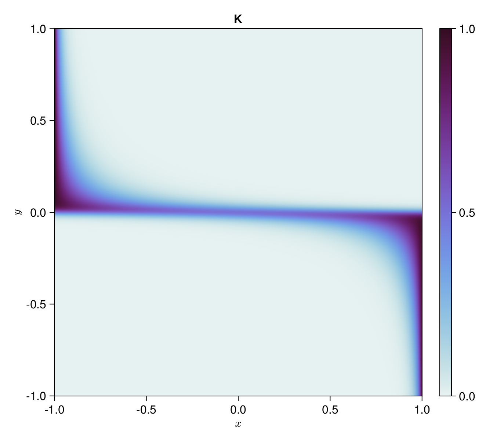
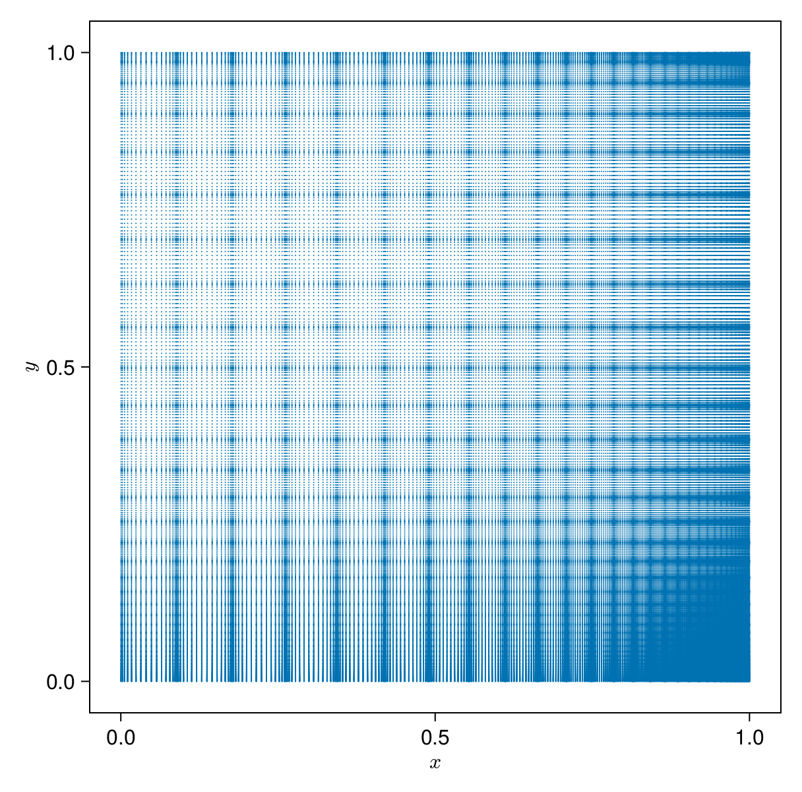

# [Introduction](@id guide)

We present `SparseIR.jl`, a Julia library for constructing and working with the intermediate representation of correlation functions [Shinaoka2017,Li2020,Shinaoka2022,Wallerberger2023](@cite).
The intermediate representation (IR) takes the matrix kernel transforming propagators between the real-frequency axis and the imaginary-time axis and performs a singular value expansion (SVE) on it.
This decomposes the matrix kernel into a set of singular values as well as two sets of functions.
One of those lives on the real-frequency axis and one on the imaginary-time axis.
Expressing a propagator in terms of either basis--by an ordinary least squares fit--then allows us to easily transition between them.
In combination with a prescription for constructing sparse sets of sampling points on each axis, we have a method for optimally compressing propagators.

`SparseIR.jl` implements the intermediate representation, providing on-the-fly computation of basis functions and singular values accurate to full precision along with routines for sparse sampling.
It is a Julia wrapper over `libsparseir`, the C library built from [sparse-ir-rs](https://github.com/SpM-lab/sparse-ir-rs), which does the numerical work; `SparseIR.jl` checks the arguments, manages the C objects and provides the Julia interface.
It is further fully unit tested, featuring near-complete code coverage.
Here, we will explain how it works by means of an example use case.
The notation follows the [notation page](https://spm-lab.github.io/sparse-ir-doc/src/notation.html) shared by the Julia, Python and Rust libraries; in particular, the index ``l`` of the basis functions counts from 0, so that Julia's `basis.u[l+1]` is ``U_l``.
In preparing this document, `SparseIR.jl` version `2.1.5` (with `libsparseir_jll` version `0.8.4`) and Julia version `1.12.5` were used.

## Problem statement
We take a problem to be solved from the `sparse-ir` paper [Wallerberger2023](@cite).
> Let us perform self-consistent second-order perturbation theory for the single impurity Anderson model at finite temperature.
> Its Hamiltonian is given by
> ```math
>     H = U c^\dagger_\uparrow c^\dagger_\downarrow c_\downarrow c_\uparrow + \sum_{p\sigma} \big(V_{p\sigma}  f_{p\sigma}^\dagger c_\sigma + V_{p\sigma}^* c_\sigma^\dagger f_{p\sigma}\big) + \sum_{p\sigma} \epsilon_{p} f_{p\sigma}^\dagger f_{p\sigma}
> ```
> where ``U`` is the electron interaction strength, ``c_\sigma`` annihilates an electron on the impurity, ``f_{p\sigma}`` annihilates an electron in the bath, ``\dagger`` denotes the Hermitian conjugate, ``p\in\mathbb R`` is bath momentum, and ``\sigma\in\{\uparrow, \downarrow\}`` the spin.
> The hybridization strength ``V_{p\sigma}`` and bath energies ``\epsilon_p`` are chosen such that the non-interacting density of states is semi-elliptic with a half-bandwidth of one, ``\rho_0(\omega) = \frac2\pi\sqrt{1-\omega^2}``, ``U=1.2``, ``\beta=10``, [...]

## [Outline](@id outline)

To provide an overview, we first give the full code used to solve the problem with `SparseIR.jl`.
```julia
using SparseIR

β = 10.0; ωmax = 8.0; ε = 1e-6;

# Construct the IR basis and sparse sampling for fermionic propagators
basis = FiniteTempBasis{Fermionic}(β, ωmax, ε)
sτ = TauSampling(basis)
siν = MatsubaraSampling(basis; positive_only=true)

# Solve the single impurity Anderson model coupled to a bath with a
# semicircular density of states with unit half bandwidth.
U = 1.2
ρ₀(ω) = 2/π * √(1 - clamp(ω, -1, +1)^2)

# Compute the IR basis coefficients for the non-interacting propagator
ρ₀l = overlap(basis.v, ρ₀)
G₀l = -basis.s .* ρ₀l

# Self-consistency loop: alternate between second-order expression for the
# self-energy and the Dyson equation until convergence.
Gl = copy(G₀l)
Σl = zero(Gl)
Gl_prev = zero(Gl)
G₀iν = evaluate(siν, G₀l)
while !isapprox(Gl, Gl_prev, rtol=ε)
    Gl_prev = copy(Gl)
    Gτ = evaluate(sτ, Gl)
    Στ = @. U^2 * Gτ^3
    Σl = fit(sτ, Στ)
    Σiν = evaluate(siν, Σl)
    Giν = @. (G₀iν^-1 - Σiν)^-1
    Gl = fit(siν, Giν)
end
```
Note that this script as presented is optimized for readability instead of performance; in practice, you would want to make minor adjustments to ensure maximum type inferrability and full type stability, among other things putting the code in a function instead of executing in global scope.
It is meant to be entered in the REPL or a notebook: in a file run with `julia script.jl`, Julia's scoping rules make the assignments inside the `while` loop local to the loop, so there the code has to be put in a function.
Such a performance-optimized version is provided in [Appendix: Optimized script](@ref optimized-script).
The following is a detailed explanation of what happens here under the hood and why.

# Treatment

If we take the second-order expression for the self-energy, which at half filling is simply
```math
    \Sigma(\tau) = U^2 \pqty{G(\tau)}^3
```
and the Dyson equation
```math
    G(\mathrm{i}\nu) = \pqty{\pqty{G_0(\mathrm{i}\nu)}^{-1} - \Sigma(\mathrm{i}\nu)}^{-1}
```
we have a system of two coupled equations.
The first one is diagonal in ``\tau`` and the second is diagonal in ``\mathrm{i}\nu``, so we need a way of converting efficiently between these two axes.

## Basis construction

We first import `SparseIR` and construct an appropriate basis.
To do so, we must first choose an appropriate frequency cutoff ``\omega_\mathrm{max}``: the basis can only represent spectral functions that vanish outside ``[-\omega_\mathrm{max}, \omega_\mathrm{max}]``.
The non-interacting density of states in our problem is semi-elliptic with half-bandwidth 1.
Once we introduce interactions via the interaction strength ``U``, this band splits into the lower and the upper Hubbard bands, centered around ``\omega = \pm U/2`` respectively.
So the bandwidth should be around ``3.2`` at a minimum, but we choose more than twice that with ``\omega_\mathrm{max} = 8`` to be safe.
```julia-repl
julia> using SparseIR

julia> β = 10.0; ωmax = 8.0; ε = 1e-6;

julia> basis = FiniteTempBasis{Fermionic}(β, ωmax, ε);

julia> length(basis)
20

julia> basis.s
20-element Vector{Float64}:
 1.4409730317545628
 1.2153954454510794
 0.7652662478347483
 0.4974067394582253
 0.2885620956231058
 0.1639819552743816
 0.08901271087151333
 0.046837974354297485
 0.02385765323350631
 0.011793733096027626
 0.0056624000214117835
 0.0026427291749051094
 0.0011996720525663934
 0.0005299554043095777
 0.00022790287514550304
 9.5440469066198e-5
 3.893189538316344e-5
 1.5472919567018e-5
 5.992753725069417e-6
 2.2623276239588636e-6
```
There is quite a lot happening behind the scenes in this first innocuous-looking statement, so we will break it down:

### Kernel
Consider a propagator/Green's function defined on the imaginary-time axis
```math
    G(\tau) \equiv -\ev{T_\tau c(\tau) c^\dagger(0)}
```
and the associated spectral function in real frequency ``A(\omega) = -(1/\pi) \;\mathrm{Im}\;G^\mathrm{R}(\omega)``, where ``G^\mathrm{R}`` is the retarded Green's function.
For fermions, as here, the weight ``\rho(\omega)`` below is the spectral function ``A(\omega)`` itself; for bosons it would be ``A(\omega)/\tanh(\beta\omega/2)``.
These are related via
```math
    G(\tau) = -\int_{-\omega_\mathrm{max}}^{+\omega_\mathrm{max}} \dd{\omega} K^\mathrm{L}(\tau, \omega) \rho(\omega)
```
with the logistic kernel
```math
    K^\mathrm{L}(\tau, \omega) = \frac{e^{-\tau\omega}}{1 + e^{-\beta\omega}}
```
mediating between them.
If we perform an SVE on this kernel, yielding the decomposition
```math
    K^\mathrm{L}(\tau, \omega) = \sum_{l=0}^\infty U_l(\tau) S_l V_l(\omega),
```
with the ``U_l``s orthonormal on ``[0, \beta]`` and the ``V_l``s orthonormal on ``[-\omega_\mathrm{max}, \omega_\mathrm{max}]``, we can write
```math
    G(\tau) = \sum_{l=0}^\infty U_l(\tau) G_l = \sum_{l=0}^{L-1} U_l(\tau) G_l + r_L(\tau)
```
with expansion coefficients given by
```math
    G_l = -\int_{-\omega_\mathrm{max}}^{+\omega_\mathrm{max}} \dd{\omega}  S_l V_l(\omega) \rho(\omega).
```
The singular values decay at least exponentially with ``\log S_l = \order{-l / \log(\beta\omega_\mathrm{max})}``.
Hence, the error ``r_L(\tau)`` we incur by representing the Green's function in this way and cutting off the sum after ``L`` terms does, too.
If we know its expansion coefficients, we can easily compute the propagator's Fourier transform by
```math
    G(\mathrm{i}\nu) = \int_0^\beta \dd{\tau} e^{\mathrm{i}\nu\tau} G(\tau) \approx \sum_{l=0}^{L-1} \hat U_l(\mathrm{i}\nu) G_l,
    \qquad
    \hat U_l(\mathrm{i}\nu) = \int_0^\beta \dd{\tau} e^{\mathrm{i}\nu\tau} U_l(\tau),
```
where ``\nu = n\pi/\beta`` is a fermionic Matsubara frequency: `SparseIR.jl` takes the reduced frequency ``n``, an odd integer (``n = 2m + 1`` with the ordinary Matsubara index ``m \in \mathbb Z``).
The representation in terms of these expansion coefficients is called the intermediate representation, which `SparseIR.jl` is concerned with.

To standardize our variables, we define ``x \in [-1,+1]`` and ``y \in [-1,+1]`` by
```math
    \tau = \beta (x+1)/2 \qand \omega = \omega_\mathrm{max} y
```
so that the kernel can be written
```math
    K^\mathrm{L}(x, y) = \frac{e^{-\Lambda y (x + 1) / 2}}{1 + e^{-\Lambda y}},
```
with ``\Lambda = \beta\omega_\mathrm{max} = 80``.
This is represented by the object `LogisticKernel(80.0)`, which `FiniteTempBasis` uses internally.


### Singular value expansion

Central is the _singular value expansion_ [Hansen2010](@cite), which `FiniteTempBasis` obtains from `libsparseir` through `SVEResult(kernel, ε)`.
Its purpose is to construct the decomposition
```math
    K(x, y) \approx \sum_{l \ge 0} u_l(x) s_l v_l(y)
```
where ``u_l(x)`` and ``v_l(y)`` are called ``K``'s left and right singular functions respectively and ``s_l`` are its singular values.
We write them in lowercase to tell them apart from the ``U_l(\tau)``, ``S_l`` and ``V_l(\omega)`` of the physical variables above.
By construction, the singular functions form an orthonormal basis, i.e.
```math
    \int \dd{x} u_l(x) u_{l'}(x) = \delta_{ll'} = \int \dd{y} v_l(y) v_{l'}(y).
```
and thus above equation is equivalent to a pair of eigenvalue equations
```math
\begin{aligned}
    s_l u_l(x) &= \int \dd{y} K(x, y) v_l(y) \\
    s_l v_l(y) &= \int \dd{x} K(x, y) u_l(x)
\end{aligned}
```
Here and in what follows, unless otherwise indicated, integrals are taken to be over the interval ``[-1,+1]`` (because we rescaled to ``x`` and ``y`` variables).
`libsparseir` computes the SVE in the following steps.

1. It first chooses the working precision.
   A result accurate to ``\varepsilon`` needs a working precision of about ``\varepsilon^2``, because in computing the SVD we incur a precision loss of about half our input digits.
   `FiniteTempBasis` passes on the ``\varepsilon = 10^{-6}`` we gave it, and with the default working type `SPIR_TWORK_AUTO` the SVE is computed in double precision (`Float64`), which suffices for ``\varepsilon \geq 10^{-8}``.
   For a smaller ``\varepsilon``, `libsparseir` switches to double-double arithmetic, a 128 bits floating point type with about 32 significant digits.

2. Then a support grid ``\{x_i\} \times \{y_j\}`` for the kernel to be evaluated later on is built.
   Along with these support points, weights ``\{w_i\}`` and ``\{z_j\}`` are computed.
   These points and weights consist of repeated scaled Gauss integration rules, such that
   ```math
       \int \dd{x} f(x) \approx \sum_i f(x_i) w_i
       \quad\text{and}\quad
       \int \dd{y} g(y) \approx \sum_j g(y_j) z_j.
   ```
   To get an idea regarding the distribution of these sampling points, refer to the following figure, which shows ``\{x_i\} \times \{y_j\}`` for ``\Lambda = 80``:
   

   #### Note:
   The points do not cover ``[-1, 1] \times [-1, 1]`` but only ``[0, 1] \times [0, 1]``.
   This is actually a special case as we exploit the kernel's centrosymmetry, i.e. ``K(x, y) = K(-x, -y)``.
   It is straightforward to show that the left/right singular vectors then can be chosen as either odd or even functions.

   Consequentially, we actually sample from a reduced kernel ``K^\mathrm{red}_\pm`` on ``[0, 1] \times [0, 1]`` that is given as either
   ```math
       K^\mathrm{red}_\pm(x, y) = K(x, y) \pm K(x, -y),
   ```
   gaining a 4-fold speedup (because we take only a quarter of the domain) in constructing the SVE.
   The full singular functions can be reconstructed by (anti-)symmetrically continuing them to the negative axis.
   ![Reduced kernels, as a function of x and y, parameterizing imaginary time and real frequency, respectively. Compare their [0,1] × [0,1] subregions with the sampling point distribution plot above.](assets/img/kernel_red.png)

   Using the integration rules allows us to approximate
   ```math
   \begin{aligned}
       s_l u_l(x_i) &\approx \sum_j K(x_i, y_j) v_l(y_j) z_j &&\forall i \\
       s_l v_l(y_j) &\approx \sum_i K(x_i, y_j) u_l(x_i) w_i &&\forall j
   \end{aligned}
   ```
   which we now multiply by ``\sqrt{w_i}`` and ``\sqrt{z_j}`` respectively to normalize our basis functions, yielding
   ```math
   \begin{aligned}
       s_l \sqrt{w_i} u_l(x_i) &\approx \sum_j \sqrt{w_i} K(x_i, y_j) \sqrt{z_j} \sqrt{z_j} v_l(y_j) \\
       s_l \sqrt{z_j} v_l(y_j) &\approx \sum_i \sqrt{w_i} K(x_i, y_j) \sqrt{z_j} \sqrt{w_i} u_l(x_i)
   \end{aligned}
   ```
   If we now define vectors ``\vec u_l``, ``\vec v_l`` and a matrix ``K`` with entries ``(\vec u_l)_i \equiv \sqrt{w_i} u_l(x_i)``, ``(\vec v_l)_j \equiv \sqrt{z_j} v_l(y_j)`` and ``K_{ij} \equiv \sqrt{w_i} K(x_i, y_j) \sqrt{z_j}``, we obtain
   ```math
   \begin{aligned}
       s_l (\vec u_l)_i &\approx \sum_j K_{ij} (\vec v_l)_j \\
       s_l (\vec v_l)_j &\approx \sum_i K_{ij} (\vec u_l)_i
   \end{aligned}
   ```
   or
   ```math
   \begin{aligned}
       s_l \vec u_l &\approx K^{\phantom{\mathrm{T}}} \vec v_l \\
       s_l \vec v_l &\approx K^\mathrm{T} \vec u_l.
   \end{aligned}
   ```
   Together with the property ``\vec u_l^\mathrm{T} \vec u_{l'} \approx \delta_{ll'} \approx \vec v_l^\mathrm{T} \vec v_{l'}`` we have successfully translated the original SVE problem into an SVD, because
   ```math
       K = \sum_l s_l \vec u_l \vec v_l^\mathrm{T}.
   ```

3. The next step is computing the matrix ``K`` derived in the previous step.

   !!! note
       In the centrosymmetric case there are actually two matrices ``K_+`` and ``K_-``, one for the even and one for the odd kernel.
       The SVDs of these matrices are later concatenated, so for simplicity, we will refer to ``K`` from here on out.

   !!! info
       Special care is taken here to avoid FP-arithmetic cancellation around ``x = -1`` and ``x = +1``.

   ![Kernel matrices, rotated 90 degrees counterclockwise to make the connection with the (subregion [0,1] × [0,1] of the) previous figure more obvious. Thus we can see how the choice of sampling points has magnified and brought to the matrices' centers the regions of interest.
   Furthermore, elements with absolute values smaller than 10\% of the maximum have been omitted to emphasize the structure; this should however not be taken to mean that there is any sparsity to speak of we could exploit in the next step.](assets/img/kernel_red_matrices.png)

4. Take the truncated singular value decomposition (trSVD) of ``K``, or rather, of ``K_+`` and ``K_-``.
   `libsparseir` first applies a rank-revealing QR decomposition with column pivoting and then an SVD, both carried out in the working precision.

5. Then we throw away superfluous terms in our expansion.
   The SVE keeps the singular values down to about twice the machine epsilon of the working precision relative to ``s_0``; for our kernel and ``\varepsilon = 10^{-6}`` these are 38 values, more than the basis needs.
   The truncation to the accuracy ``\varepsilon`` we asked for is done when the basis is built (see below).

6. Finally, a postprocessing step turns the SVD result into the SVE we actually want.
   The functions are represented as piecewise Legendre polynomials, which model a function on the interval ``[x_\mathrm{min}, x_\mathrm{max}]`` as a set of segments on the intervals ``[a_i, a_{i+1}]``, where on each interval the function is expanded in scaled Legendre polynomials.
   The interval endpoints are chosen such that they reflect the approximate position of roots of a high-order singular function in ``x``.

### Finishing touches

The difficult part of constructing the `FiniteTempBasis` is now over.
Next we truncate the expansion to the basis size ``L``, the number of singular values with ``s_l / s_0 \geq \varepsilon``, by discarding ``u_l`` and ``v_l`` with indices ``l \geq L``.
For ``\varepsilon = 10^{-6}`` this gives ``L = 20``: ``s_{19}/s_0 \approx 1.6 \times 10^{-6}`` is kept and ``s_{20}/s_0 \approx 5.8 \times 10^{-7}`` is not.
The functions are now scaled to imaginary-time and frequency according to
```math
    \tau = \beta/2 (x + 1) \qand \omega = \omega_\mathrm{max} y,
```
that is,
```math
    U_l(\tau) = \sqrt{2/\beta}\, u_l(x), \qquad
    V_l(\omega) = \sqrt{1/\omega_\mathrm{max}}\, v_l(y), \qquad
    S_l = \sqrt{\beta\omega_\mathrm{max}/2}\, s_l.
```
The singular values need to be multiplied by ``\sqrt{(\beta/2)\omega_\mathrm{max}}`` so that the ``U_l`` and ``V_l`` are orthonormal on ``[0, \beta]`` and ``[-\omega_\mathrm{max}, \omega_\mathrm{max}]`` while ``\sum_l U_l(\tau) S_l V_l(\omega)`` is still the same kernel.
We also add to our basis ``\hat{U}_l(\mathrm{i}\nu)``, the Fourier transforms of the left singular functions, defined on the fermionic Matsubara frequencies ``\nu = n\pi/\beta`` with odd ``n``.
This is particularly simple, because the Legendre polynomials' Fourier transforms are known analytically and given by spherical Bessel functions; `libsparseir` uses them for small ``|n|`` and an asymptotic expansion for large ``|n|``.

We can now take a look at our basis functions to get a feel for them.
The legends of the figures give Julia's index ``l + 1`` of the functions, and the Matsubara frequency axis is labelled ``\omega`` for ``\nu``.


Looking back at the image of the kernel ``K(x,y)`` we can imagine how it is reconstructed by multiplying and summing (including a factor ``S_l``) ``U_l(\tau)`` and ``V_l(\omega)``.
An important property of the left singular functions is interlacing, i.e. ``U_l`` interlaces ``U_{l+1}``.
A function ``g`` with roots ``a_{k-1} \leq \ldots \leq a_1`` interlaces a function ``f`` with roots ``b_k \leq \ldots \leq b_1`` if
```math
    b_k \leq a_{k-1} \leq b_{k-1} \leq \ldots \leq b_1.
```
We will use this property for constructing our sparse sampling set.


As for the Matsubara basis functions, we plot only the non-zero components, i.e. ``\mathrm{Im}\;\hat U_l\,(\mathrm{i}\nu)`` with even ``l`` and  ``\mathrm{Re}\;\hat U_l\,(\mathrm{i}\nu)`` with odd ``l``; for bosons it would be the other way round.

## Constructing the samplers

With our basis complete, we construct sparse sampling objects for fermionic propagators on the imaginary-time axis and on the Matsubara frequency axis.
```julia-repl
julia> sτ = TauSampling(basis);

julia> show(sampling_points(sτ))
[0.018885255322830252, 0.10059312563924505, 0.2521890040678587, 0.48221173192287026, 0.8042299148202525, 1.2376463941117466, 1.8067997157665194, 2.535059399859393, 3.4296355795046067, 4.458868515730588, 5.541131484269412, 6.570364420495394, 7.464940600140607, 8.19320028423348, 8.762353605888254, 9.195770085179747, 9.51778826807713, 9.747810995932142, 9.899406874360754, 9.98111474467717]

julia> siν = MatsubaraSampling(basis; positive_only=true);

julia> show(sampling_points(siν))
FermionicFreq[FermionicFreq(1), FermionicFreq(3), FermionicFreq(5), FermionicFreq(7), FermionicFreq(9), FermionicFreq(11), FermionicFreq(17), FermionicFreq(27), FermionicFreq(49), FermionicFreq(153)]
```
Both functions first determine a suitable set of sampling points on their respective axis.
In the case of `TauSampling`, the sampling points ``\{\tau_i\}`` are chosen as the roots of ``U_L``, the first basis function beyond the basis, folded into ``(0, \beta)``; this works because ``U_l`` has exactly ``l`` roots in ``(0, \beta)``.
This turns out to be close to optimal with respect to conditioning for this size (within a few percent).
Similarly, `MatsubaraSampling` chooses sampling points ``\{\mathrm{i}\nu_k\}`` as the sign changes of the first discarded Matsubara basis function ``\hat U_l``, with ``l \geq L`` chosen to fit the parity (here ``\hat U_{20}``).
The points are returned as `FermionicFreq`s of the reduced frequencies ``n``.
By setting `positive_only=true`, one assumes that functions to be fitted are symmetric in
Matsubara frequency, i.e.
```math
    G(-\mathrm{i}\nu) = \qty(G(\mathrm{i}\nu))^*,
```
or, equivalently, real in imaginary time.
In this case, sparse sampling is performed over non-negative frequencies ``n \geq 0`` only, cutting away half of the necessary sampling space, so we get only 10 sampling points instead of the 20 in the imaginary-time case.

Then, both compute design matrices by ``E^\tau_{il} = U_l(\tau_i)`` and ``E^\nu_{kl} = \hat{U}_l(\mathrm{i}\nu_k)`` as well as their SVDs.
We are now able to get the IR basis coefficients of a function that is known on the imaginary-time sampling points by solving the fitting problem
```math
    G_l = \mathrm{arg\,min}_{G_l} \sum_{\{\tau_i\}} \norm{G(\tau_i) - \sum_l E^\tau_{il} G_l}^2,
```
which can be done efficiently once the SVD is known.
The same can be done on the Matsubara axis
```math
    G_l = \mathrm{arg\,min}_{G_l} \sum_{\{\mathrm{i}\nu_k\}} \norm{G(\mathrm{i}\nu_k) - \sum_l E^\nu_{kl} G_l}^2
```
and taken together we now have a way of moving efficiently between both.
In solving these problems, we need to take their conditioning into consideration; in the case of the Matsubara axis, the problem is somewhat worse conditioned than on the imaginary-time axis due to its discrete nature.
For our basis, `cond(sτ)` is about 4.7 and `cond(siν)` about 12.6 (`cond` is from `LinearAlgebra`).
The default fermionic set of Matsubara points has as many points as the basis has functions, 20 here; a bosonic basis of the same size gets 21 points, since bosonic sets always include ``n = 0``.


## Initializing the iteration

Because the non-interacting density of states is given ``\rho_0(\omega) = \frac{2}{\pi}\sqrt{1 - \omega^2}``, we can easily get the IR basis coefficients for the non-interacting propagator
```math
    {G_0}_l = -S_l {\rho_0}_l = -S_l \int \dd{\omega} V_l(\omega) \rho_0(\omega)
```
by utilizing the `overlap` function, which implements integration (over ``[-\omega_\mathrm{max}, \omega_\mathrm{max}]`` for `basis.v`).
```julia-repl
julia> U = 1.2
1.2

julia> ρ₀(ω) = 2/π * √(1 - clamp(ω, -1, +1)^2)
ρ₀ (generic function with 1 method)

julia> ρ₀l = overlap(basis.v, ρ₀)
20-element Vector{Float64}:
  0.6012443165417244
 -7.806255641895632e-18
 -0.31145094728962053
  ⋮
 -8.239936510889834e-18
 -0.047006351388363926
 -2.3852447794681098e-18

julia> G₀l = -basis.s .* ρ₀l
20-element Vector{Float64}:
 -0.8663768456323286
  9.487687553186743e-18
  0.23834289781690587
  ⋮
  1.2749587487033335e-22
  2.8169748738453986e-7
  5.3962051544943725e-24
```
The coefficients of the full Green's function are then initialized with those of the non-interacting one.
Also, we will need the non-interacting propagator in Matsubara for the Dyson equation, so we `evaluate` with the `MatsubaraSampling` object created before.
```julia-repl
julia> Gl = copy(G₀l)
20-element Vector{Float64}:
 -0.8663768456323286
  9.487687553186743e-18
  0.23834289781690587
  ⋮
  1.2749587487033335e-22
  2.8169748738453986e-7
  5.3962051544943725e-24

julia> Σl = zero(Gl)
20-element Vector{Float64}:
 0.0
 0.0
 0.0
 ⋮
 0.0
 0.0
 0.0

julia> Gl_prev = zero(Gl)
20-element Vector{Float64}:
 0.0
 0.0
 0.0
 ⋮
 0.0
 0.0
 0.0

julia> G₀iν = evaluate(siν, G₀l)
10-element Vector{ComplexF64}:
    7.74581076866081e-17 - 1.4680555237013286im
  -2.387594600001887e-17 - 0.8633270688082166im
 -1.2380603588528934e-17 - 0.5825991240254584im
                         ⋮
 -1.1534220135646405e-17 - 0.11748573816801787im
 -2.0808101233386505e-18 - 0.06489281188294711im
   -3.57527202836115e-19 - 0.020802317001514338im
```

## Self-consistency loop

We are now ready to tackle the coupled equations from the start, and will restate them here for the reader's convenience:
```math
    \Sigma(\tau) = U^2 \pqty{G(\tau)}^3
```
and the Dyson equation
```math
    G(\mathrm{i}\nu) = \pqty{\pqty{G_0(\mathrm{i}\nu)}^{-1} - \Sigma(\mathrm{i}\nu)}^{-1}.
```
The first one is diagonal in ``\tau`` and the second is diagonal in ``\mathrm{i}\nu``, so we employ the IR basis to efficiently convert between the two bases.
Starting with our approximation to ``G_l`` we evaluate in the ``\tau``-basis to get ``G(\tau)``, from which we can compute the self-energy on the sampling points ``\Sigma(\tau)`` according to the first equation.
This can now be fitted to the ``\tau``-basis to get ``\Sigma_l``, and from there ``\Sigma(\mathrm{i}\nu)`` via evaluation in the ``\mathrm{i}\nu``-basis.
Now the Dyson equation is used to get ``G(\mathrm{i}\nu)`` on the sampling frequencies, which is then fitted to the ``\mathrm{i}\nu``-basis yielding ``G_l`` and completing the loop.
This is now performed until convergence.
```julia-repl
julia> while !isapprox(Gl, Gl_prev, rtol=ε)
           Gl_prev = copy(Gl)
           Gτ = evaluate(sτ, Gl)
           Στ = @. U^2 * Gτ^3
           Σl = fit(sτ, Στ)
           Σiν = evaluate(siν, Σl)
           Giν = @. (G₀iν^-1 - Σiν)^-1
           Gl = fit(siν, Giν)
       end
```
This is what one iteration looks like spelled out in equations:
```math
\begin{aligned}
    G^\mathrm{prev}_l &= G_l \\
    G(\tau_i) &= \sum_l U_l(\tau_i) G_l \\
    \Sigma(\tau_i) &= U^2 \pqty{G(\tau_i)}^3 \\
    \Sigma_l &= \mathrm{arg\,min}_{\Sigma_l} \sum_{\{\tau_i\}} \norm{\Sigma(\tau_i) - \sum_l U_l(\tau_i) \Sigma_l}^2 \\
    \Sigma(\mathrm{i}\nu_k) &= \sum_l \hat U_l(\mathrm{i}\nu_k) \Sigma_l \\
    G(\mathrm{i}\nu_k) &= \pqty{\pqty{G_0(\mathrm{i}\nu_k)}^{-1} - \Sigma(\mathrm{i}\nu_k)}^{-1} \\
    G_l &= \mathrm{arg\,min}_{G_l} \sum_{\{\mathrm{i}\nu_k\}} \norm{G(\mathrm{i}\nu_k) - \sum_l \hat U_l(\mathrm{i}\nu_k) G_l}^2
\end{aligned}
```
We consider the iteration converged when the difference between subsequent iterations does not exceed the basis accuracy, i.e. when
```math
    \norm{G_l - G^\mathrm{prev}_l} \leq \varepsilon \max\Bqty{\norm{G_l}, \norm{G^\mathrm{prev}_l}},
```
where the norm is ``\norm{G_l}^2 = \sum_{l=0}^{L-1} \abs{G_l}^2``.

The entire script, as presented in [Appendix: Optimized script](@ref optimized-script), takes around 70ms to run (after compilation) on the machine used for this document (an AMD EPYC 7713P) and allocates roughly 6MB in the process.

## Visualizing the solution

To plot our solution for the self-energy, we create a `MatsubaraSampling` object on a dense box of sampling frequencies.
In this case, we only need it for expanding with `evaluate`, i.e. multiplying a vector.
```julia-repl
julia> box = FermionicFreq.(1:2:79)
40-element Vector{FermionicFreq}:
  π/β
  3π/β
  5π/β
                 ⋮
 75π/β
 77π/β
 79π/β

julia> siν_box = MatsubaraSampling(basis; sampling_points=box);

julia> Σiν_box = evaluate(siν_box, Σl)
40-element Vector{ComplexF64}:
   3.768526689708544e-17 - 0.0932592397471911im
 -2.4704997587431176e-17 - 0.12259160207736851im
   2.220463254211873e-17 - 0.11744985472120795im
                         ⋮
   5.372677127761545e-17 - 0.01517559774305718im
   5.291518286524916e-17 - 0.014786512975659341im
  5.3450988249441747e-17 - 0.014416763475903835im
```
We are now in a position to visualize the results of our calculation in the figure below:
- In the main plot, the imaginary part of the self-energy in Matsubara alongside the sampling points on which it was computed.
  This illustrates very nicely one of the main advantages of our method: During the entire course of the iteration we only ever need to store and calculate the values of all functions on the sparse set of sampling points and are still able to expand the result on a dense frequency set in the end.
- In the inset, the IR basis coefficients of the self-energy and of the propagator are shown, along with the basis singular values.
  We only plot the non-vanishing basis coefficients, which are those at even values of ``l`` because the real parts of ``G(\mathrm{i}\nu)`` and ``\Sigma(\mathrm{i}\nu)`` are almost zero.
  The singular values ``S_l/S_0`` are the bound for ``\abs{G_l / G_0}`` and ``\abs{\Sigma_l / \Sigma_0}``.
  The inset labels the coefficients by Julia's index ``l + 1``, so that its ``|G_\ell/G_1|`` is ``|G_l/G_0|`` here.


# Summary and outlook

We introduced `SparseIR.jl`, a full featured Julia interface to the intermediate representation, built on the `libsparseir` C library.
By means of a simple example, we explained in detail how to use it and the way it works internally.
In this example, we solved an Anderson impurity model with elliptical density of states to second order perturbation theory in the interaction via a self-consistent loop.
We successfully obtained the self-energy (accurate to second order) with minimal computational effort.

Regarding further work, perhaps the single most obvious direction is the extension to multi-particle quantities; And indeed, Refs. [Shinaoka2018,Wallerberger2021](@cite) did exactly this, with Markus Wallerberger writing the as of yet unpublished Julia library `OvercompleteIR.jl` which builds upon `SparseIR.jl`.
So, as a transitive dependency, `SparseIR.jl` has already found applications in solving the parquet equations for the Hubbard model and for the Anderson impurity model [Michalek2024](@cite).

# References

```@bibliography
```

# [Appendix: Optimized script](@id optimized-script)
With minimal modifications we can transform our code to be more optimized for performance:
- Put script in a function. This is because globals are type instable in Julia.
- Add `::Vector{Float64}` annotation to ensure type inferrability of `ρ₀l`.
- `Gl` in the loop will be a `Vector{ComplexF64}` in the loop, so make it `complex` right away for type stability.
- Preallocate and reuse arrays to remove allocations in the loop, minimizing total allocations and time spent garbage collecting. Here we benefit from `SparseIR.jl` providing in-place variants `fit!` and `evaluate!`.
```julia
using SparseIR

function main(; β=10.0, ωmax=8.0, ε=1e-6)
    # Construct the IR basis and sparse sampling for fermionic propagators
    basis = FiniteTempBasis{Fermionic}(β, ωmax, ε)
    sτ = TauSampling(basis)
    siν = MatsubaraSampling(basis; positive_only=true)

    # Solve the single impurity Anderson model coupled to a bath with a
    # semicircular density of states with unit half bandwidth.
    U = 1.2
    ρ₀(ω) = 2 / π * √(1 - clamp(ω, -1, +1)^2)

    # Compute the IR basis coefficients for the non-interacting propagator
    ρ₀l = overlap(basis.v, ρ₀)::Vector{Float64}
    G₀l = -basis.s .* ρ₀l

    # Self-consistency loop: alternate between second-order expression for the
    # self-energy and the Dyson equation until convergence.
    Gl = complex(G₀l)
    G₀iν = evaluate(siν, G₀l)

    # Preallocate arrays for the self-energy and the Green's function
    Σl = similar(Gl)
    Στ = similar(Gl, ComplexF64, length(sampling_points(sτ)))
    Σiν = similar(G₀iν)
    Gτ = similar(Στ)
    Giν = similar(G₀iν)

    Gl_prev = zero(Gl)
    while !isapprox(Gl, Gl_prev, rtol=ε)
        Gl_prev .= Gl
        evaluate!(Gτ, sτ, Gl)
        @. Στ = U^2 * Gτ^3
        fit!(Σl, sτ, Στ)
        evaluate!(Σiν, siν, Σl)
        @. Giν = (G₀iν^-1 - Σiν)^-1
        fit!(Gl, siν, Giν)
    end
    return basis, Σl
end
```
