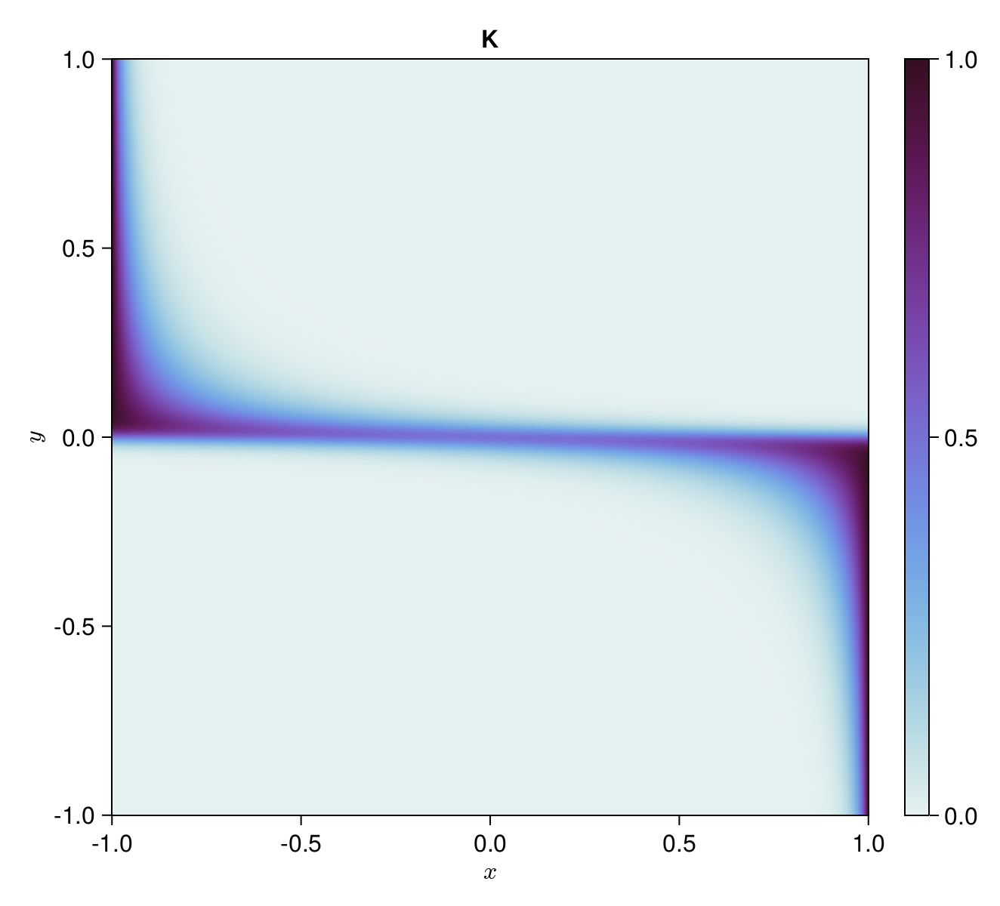
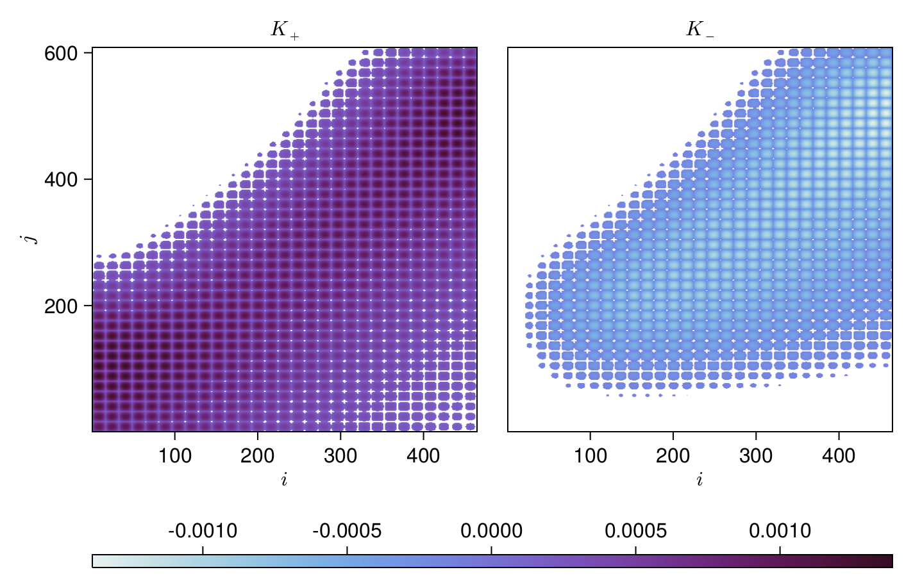

# [Introduction](@id guide)

We present `SparseIR.jl`, a Julia library for constructing and working with the intermediate representation of correlation functions [Shinaoka2017,Li2020,Shinaoka2022,Wallerberger2023](@cite).
The intermediate representation (IR) takes the matrix kernel occuring in transforming propagators between the real frequency axis and the imaginary time axis and performs singular value expansion (SVE) on it, decomposing it into a set of singular values as well as two sets of functions.
One of those lives on the real frequency axis and one on the imaginary time axis and they each constitute a basis for the space of all propagators on their respective axis.
Expressing a propagator in terms of either basis--by an ordinary least squares fit--then allows us to easily transition between them.
In combination with a prescription for constructing sparse sets of sampling points on each axis, we have a method for optimally compressing propagators.

`SparseIR.jl` implements the intermediate representation, providing on-the-fly computation of basis functions and singular values accurate to full precision along with routines for sparse sampling.
Here, we will explain its inner workings by means of a worked example use case.

## Problem statement
We take a problem to be solved from the `sparse-ir` paper [Wallerberger2023](@cite).
> Let us perform self-consistent second-order perturbation theory for the single impurity Anderson model at finite temperature.
> Its Hamiltonian is given by
> ```math
>     H = U c^\dagger_\uparrow c^\dagger_\downarrow c_\downarrow c_\uparrow + \sum_{p\sigma} \big(V_{p\sigma}  f_{p\sigma}^\dagger c_\sigma + V_{p\sigma}^* c_\sigma^\dagger c_\sigma^\dagger\big) + \sum_{p\sigma} \epsilon_{p} f_{p\sigma}^\dagger f_{p\sigma}
> ```
> where ``U`` is the electron interaction strength, ``c_\sigma`` annihilates an electron on the impurity, ``f_{p\sigma}`` annihilates an electron in the bath, ``\dagger`` denotes the Hermitian conjugate, ``p\in\mathbb R`` is bath momentum, and ``\sigma\in\{\uparrow, \downarrow\}`` is spin.
> The hybridization strength ``V_{p\sigma}`` and bath energies ``\epsilon_p`` are chosen such that the non-interacting density of states is semi-elliptic with a half-bandwidth of one, ``\rho_0(\omega) = \frac2\pi\sqrt{1-\omega^2}``, ``U=1.2``, ``\beta=10``, and the system is assumed to be half-filled.

## [Outline](@id outline)

To provide an overview, we first give the full code used to solve the problem with `SparseIR.jl`.
```julia
using SparseIR

β = 10.0; ωmax = 8.0; ε = 1e-6;

# Construct the IR basis and sparse sampling for fermionic propagators
basis = FiniteTempBasis{Fermionic}(β, ωmax, ε)
sτ = TauSampling(basis)
siω = MatsubaraSampling(basis; positive_only=true)

# Solve the single impurity Anderson model coupled to a bath with a
# semicircular density of states with unit half bandwidth.
U = 1.2
ρ₀(ω) = 2/π * √(1 - clamp(ω, -1, +1)^2)

# Compute the IR basis coefficients for the non-interacting propagator
ρ₀l = overlap.(basis.v, ρ₀)
G₀l = -basis.s .* ρ₀l

# Self-consistency loop: alternate between second-order expression for the
# self-energy and the Dyson equation until convergence.
Gl = copy(G₀l)
Σl = zero(Gl)
Gl_prev = zero(Gl)
G₀iω = evaluate(siω, G₀l)
while !isapprox(Gl, Gl_prev, rtol=ε)
    Gl_prev = copy(Gl)
    Gτ = evaluate(sτ, Gl)
    Στ = @. U^2 * Gτ^3
    Σl = fit(sτ, Στ)
    Σiω = evaluate(siω, Σl)
    Giω = @. (G₀iω^-1 - Σiω)^-1
    Gl = fit(siω, Giω)
end
```
The following is a detailed explanation of what happens here.

# Treatment

## Basis construction

We first import `SparseIR` and construct an appropriate basis (``\omega_\mathrm{max} = 8`` should be more than enough for this example):
```julia-repl
julia> using SparseIR

julia> β = 10.0; ωmax = 8.0; ε = 1e-6;

julia> basis = FiniteTempBasis{Fermionic}(β, ωmax, ε)
20-element FiniteTempBasis{Fermionic} with β = 10.0, ωmax = 8.0 and singular values:
 1.4409730317545617
 1.2153954454510802
 0.7652662478347486
 0.49740673945822533
 0.288562095623106
 0.1639819552743817
 0.08901271087151318
 0.046837974354297436
 0.023857653233506308
 0.01179373309602762
 0.005662400021411787
 0.0026427291749051072
 0.0011996720525663963
 0.0005299554043095754
 0.00022790287514550545
 9.544046906619884e-5
 3.8931895383167936e-5
 1.5472919567017398e-5
 5.992753725069063e-6
 2.2623276239584257e-6
```
There is quite a lot happening behind the scenes in this first innocuous-looking statement, so we will break it down:
Because we did not specify otherwise, the constructor chose the analytic continuation kernel for fermions, `LogisticKernel(80.0)`, defined by
```math
    K(x, y) = \frac{e^{-\Lambda y (x + 1) / 2}}{1 + e^{-\Lambda y}},
```
for us, where 80.0 is the value of the scale parameter ``\Lambda = \beta\omega_\mathrm{max}``.
This kernel is visualized below.


### Singular value expansion

Central is the _singular value expansion_'s (SVE) computation, which is handled by the function `SVEResult`:
Its purpose is to construct the decomposition
```math
    K(x, y) \approx \sum_{\ell = 0}^L U_\ell(x) S_\ell V_\ell(y)
```
where ``U_\ell(x)`` and ``V_\ell(y)`` are called ``K``'s left and right singular functions respectively and ``S_\ell`` are its singular values.
By construction, the singular functions form an orthonormal basis, i.e.
```math
    \int \dd{x} U_\ell(x) U_{\ell'}(x) = \delta_{\ell\ell'} = \int \dd{y} V_\ell(y) V_{\ell'}(y).
```
and thus
```math
\left.
\begin{aligned}
    S_\ell U_\ell(x) &= \int \dd{y} K(x, y) V_\ell(y) \\
    S_\ell V_\ell(y) &= \int \dd{x} K(x, y) U_\ell(x)
\end{aligned}
\right\}
```
Here and in what follows, unless otherwise indicated, integrals are taken to be over the interval ``[-1,1]``.

1. The function first calls the `choose_accuracy` helper and thereby sets the appropriate working precision.
   Because we did not specify a working accuracy ``\varepsilon``, it chooses for us ``\varepsilon \approx 2.2 \times 10^{-16}`` and working type `Float64x2` - a 128 bits floating point type provided by the MultiFloats.jl package - because in computing the SVD we incur a precision loss of about half our input bits, leaving us with full double accuracy results only if we use quad precision during the computation.

2. Then - by calling out to the `CentrosymmSVE` constructor - a support grid ``\{x_i\} \times \{y_j\}`` the kernel will later be evaluated on is built.
   Along with these support points weights ``\{w_i\}`` and ``\{z_j\}`` are computed.
   These points and weights consist of repeated scaled Gauss integration rules, such that
   ```math
       \int \dd{x} f(x) \approx \sum_i f(x_i) w_i
       \quad\text{and}\quad
       \int \dd{y} g(y) \approx \sum_j g(y_j) z_j.
   ```
   To get an idea regarding the distribution of these sampling points, refer to following figure, which shows ``\{x_i\} \times \{y_j\}`` for ``\Lambda = 80``:
   
   
   
   #### Note:
   The points do not cover ``[-1, 1] × [-1, 1]`` but only ``[0, 1] × [0, 1]``.
   This is actually a special case as we exploit the kernel's centrosymmetry, i.e. ``K(x, y) = K(-x, -y)``.
   It is straightforward to show that the left/right singular vectors then can be chosen as either odd or even functions.

   Consequentially, they are singular functions of a reduced kernel ``K^\mathrm{red}_\pm`` on ``[0, 1] × [0, 1]`` that is given as either:
   ```math
       K^\mathrm{red}_\pm(x, y) = K(x, y) \pm K(x, -y)
   ```
   It is these reduced kernels we will actually sample from, gaining a 4-fold speedup in constructing the SVE.
   

   Using the integration rules allows us to approximate
   ```math
   \left.
   \begin{aligned}
       S_\ell U_\ell(x_i) &\approx \sum_j K(x_i, y_j) V_\ell(y_j) z_j &&\forall i \\
       S_\ell V_\ell(y_j) &\approx \sum_i K(x_i, y_j) U_\ell(x_i) w_i &&\forall j
   \end{aligned}
   \right\}
   ```
   which we now multiply by ``\sqrt{w_i}`` and ``\sqrt{z_j}`` respectively, yielding
   ```math
   \left.
   \begin{aligned}
       S_\ell \sqrt{w_i} U_\ell(x_i) &\approx \sum_j \sqrt{w_i} K(x_i, y_j) \sqrt{z_j} \sqrt{z_j} V_\ell(y_j) \\
       S_\ell \sqrt{z_j} V_\ell(y_j) &\approx \sum_i \sqrt{w_i} K(x_i, y_j) \sqrt{z_j} \sqrt{w_i} U_\ell(x_i)
   \end{aligned}
   \right\}
   ```
   If we now define vectors ``\vec u_\ell``, ``\vec v_\ell`` and a matrix ``K`` with entries ``u_{\ell, i} \equiv \sqrt{w_i} U_\ell(x_i)``, ``v_{\ell, j} \equiv \sqrt{z_j} V_\ell(y_j)`` and ``K_{ij} \equiv \sqrt{w_i} K(x_i, y_j) \sqrt{z_j}``, then
   ```math
   \left.
   \begin{aligned}
       S_\ell u_{\ell, i} &\approx \sum_j K_{ij} v_{\ell, j} \\
       S_\ell v_{\ell, j} &\approx \sum_i K_{ij} u_{\ell, i}
   \end{aligned}
   \right\}
   ```
   or
   ```math
   \left.
   \begin{aligned}
       S_\ell \vec u_\ell &\approx K^{\phantom{\mathrm{T}}} \vec v_\ell \\
       S_\ell \vec v_\ell &\approx K^\mathrm{T} \vec u_\ell.
   \end{aligned}
   \right\}
   ```
   Together with the property ``\vec u_\ell^\mathrm{T} \vec u_{\ell'} \approx \delta_{\ell\ell'} \approx \vec v_\ell^\mathrm{T} \vec v_{\ell'}`` we have successfully translated the original SVE problem into an SVD, because
   ```math
       K = \sum_\ell S_\ell \vec u_\ell \vec v_\ell^\mathrm{T}.
   ```

3. The next step is calling the `matrices` function which computes the matrix ``K`` derived in the previous step.

   !!! note
       The function is named in the plural because in the centrosymmetric case it actually returns two matrices ``K_+`` and ``K_-``, one for the even and one for the odd kernel.
       The SVDs of these matrices are later concatenated, so for simplicity, we will refer to ``K`` from here on out.

   !!! info
       Special care is taken here to avoid FP-arithmetic cancellation around ``x = -1`` and ``x = +1``.

   
   Note that in the plot, the matrices are rotated 90 degrees counterclockwise to make the connection with the (subregion ``[0, 1] \times [0, 1]`` of the) previous figure more obvious.
   Thus we can see how the choice of sampling points has magnified and brought to the matrices' centers the regions of interest.
   Furthermore, elements with absolute values smaller than ``10\%`` of the maximum have been omitted to emphasize the structure; this should however not be taken to mean that there is any sparsity to speak of we could exploit in the next step.

4. Take the truncated singular value decomposition (TSVD) of ``K``, or rather, of ``K_+`` and ``K_-``.
   We use here a custom TSVD routine written by Markus Wallerberger which combines a homemade rank-revealing QR decomposition with `GenericLinearAlgebra.svd!`.
   This is necessary because there is currently no TSVD for arbitrary types available.

5. Via the function `truncate`, we throw away superfluous terms in our expansion.
   More specifically, we choose the basis size ``L`` such that ``S_\ell / S_0 > \varepsilon`` for all ``\ell \leq L``.
   Here ``\varepsilon`` is our selected precision, in our case it's equal to the double precision machine epsilon, ``2^{-52} \approx 2.22 \times 10^{-16}``.

6. Finally, we need a postprocessing step implemented in `postprocess` which performs some technical manipulation to turn the SVD result into the SVE we actually want.
   The functions are represented as piecewise Legendre polynomials, which model a function on the interval ``[x_\mathrm{min}, x_\mathrm{max}]`` as a set of segments on the intervals ``[a_i, a_{i+1}]``, where on each interval the function is expanded in scaled Legendre polynomials.

### The finishing touches

The difficult part of constructing the `FiniteTempBasis` is now over.
Next we truncate the left and right singular functions by discarding ``U_\ell`` and ``V_\ell`` with indices ``\ell > L`` to match the ``S_\ell``.
The functions are now scaled to imaginary time and frequency according to
```math
    \tau = \beta/2 (x + 1) \qand \omega = \omega_\mathrm{max} y
```
and to match them, the singular values are multiplied by ``\sqrt{(\beta/2)\omega}``.
We also add to our basis ``\hat{U}_\ell(\mathrm{i}\omega)``, the Fourier transforms of the left singular functions, defined on the fermionic Matsubara frequencies ``\mathrm{i}\omega = \mathrm{i}(2n+1)\beta/\pi`` (with integer ``n``).
This is particularly simple, because the Legendre polynomials' Fourier transforms are known analytically and given by spherical Bessel functions, for which we can rely on `Bessels.jl` [Helton2022](@cite).

We can now take a look at our basis functions to get a feel for them:


Looking back at the image of the kernel ``K(x,y)`` we can imagine how it is reconstructed by multiplying and summing (including a factor ``S_\ell``) ``U_\ell(\tau)`` and ``V_\ell(\omega)``.

As for the Matsubara basis functions, we plot only the non-zero components, i.e. ``\mathrm{Im}\;\hat U_\ell\,(\mathrm{i}\omega)`` with odd ``\ell`` and  ``\mathrm{Re}\;\hat U_\ell\,(\mathrm{i}\omega)`` with even ``\ell``.

## Constructing the samplers

With our basis complete, we construct sparse sampling objects for fermionic propagators on the imaginary time axis and on the Matsubara frequency axis.
```julia-repl
julia> sτ = TauSampling(basis)
TauSampling64 with sampling points:
 0.018885255323127792
 0.10059312563754808
 0.25218900406693556
 0.4822117319309194
 0.8042299148252774
 1.2376463941125326
 1.8067997157763205
 2.535059399842931
 3.4296355795122793
 4.45886851573216
 5.541131484267839
 6.570364420487721
 7.464940600157068
 8.19320028422368
 8.762353605887466
 9.195770085174722
 9.51778826806908
 9.747810995933065
 9.899406874362452
 9.981114744676873

julia> siω = MatsubaraSampling(basis; positive_only=true)
MatsubaraSampling{FermionicFreq, ComplexF64, SparseIR.SplitSVD{Float64}} with sampling points:
 FermionicFreq(1)
 FermionicFreq(3)
 FermionicFreq(5)
 FermionicFreq(7)
 FermionicFreq(9)
 FermionicFreq(11)
 FermionicFreq(17)
 FermionicFreq(27)
 FermionicFreq(49)
 FermionicFreq(153)
```
Both functions first determine a suitable set of sampling points on their respective axis.
In the case of `TauSampling`, the sampling points ``\{\tau_i\}`` are chosen as the extrema of the highest-order basis function in imaginary time.
This turns out to be close to optimal with respect to conditioning for this size (within a few percent).
Similarly, `MatsubaraSampling` chooses sampling points ``\{\mathrm{i}\omega_n\}`` as the (discrete) extrema of the highest-order basis function in Matsubara.
By setting `positive_only=true`, one assumes that functions to be fitted are symmetric in
Matsubara frequency, i.e.:
```math
    \hat G(\mathrm{i}\omega) = \qty(\hat G(-\mathrm{i}\omega))^*
```
or equivalently, that they are purely real in imaginary time.
In this case, sparse sampling is performed over non-negative frequencies only, cutting away half of the necessary sampling space, so we get only 10 sampling points instead of the 20 in the imaginary time case.

Then, both compute design matrices by ``E^\tau_{i\ell} = u_\ell(\tau_i)`` and ``E^\omega_{n\ell} = \hat{u}_\ell(i\omega_n)`` as well as their SVDs.
We are now able to get the IR basis coefficients of a function that is known on the imaginary time sampling points by solving the fitting problem
```math
    G_\ell = \mathrm{arg}\,\mathrm{min}_{G_\ell} \sum_i \norm{G(\tau_i) - \sum_\ell E^\tau_{i\ell} G_\ell}^2,
```
which can be done efficiently once the SVD is known.
The same can be done on the Matsubara axis
```math
    G_\ell = \mathrm{arg}\,\mathrm{min}_{G_\ell} \sum_n \norm{\hat{G}(\mathrm{i}\omega_n) - \sum_\ell E^\omega_{n\ell} G_\ell}^2
```
and taken together we now have a way of moving efficiently between both.

## Initializing the iteration

Because the non-interacting density of states is given ``\rho_0(\omega) = \frac{2}{\pi}\sqrt{1 - \omega^2}``, we can easily get the IR basis coefficients for the non-interacting propagater
```math
    {G_0}_\ell = -S_\ell {\rho_0}_\ell = -S_\ell \int \dd{\omega} V_\ell(\omega) \rho_0(\omega)
```
by utilizing the `overlap` function, which implements integration.
```julia-repl
julia> U = 1.2
1.2

julia> ρ₀(ω) = 2/π * √(1 - clamp(ω, -1, +1)^2)
ρ₀ (generic function with 1 method)

julia> ρ₀l = overlap.(basis.v, ρ₀)
20-element Vector{Float64}:
  0.601244316541724
  1.3444106938820255e-17
 -0.3114509472896204
  ⋮
 -4.553649124439119e-18
 -0.04700635138837371
  1.734723475976807e-18

julia> G₀l = -basis.s .* ρ₀l
20-element Vector{Float64}:
 -0.8663768456323275
 -1.6339906341599403e-17
  0.23834289781690587
  ⋮
  7.045824663886568e-23
  2.816974873845819e-7
 -3.924512839631511e-24
```
The coefficients of the full Green's function are then initialized with those of the non-interacting one.
Also, we will need the non-interacting propagator in Matsubara for the Dyson equation, so we `evaluate` with the `MatsubaraSampling` object created before.
```julia-repl
julia> Gl = copy(G₀l)
20-element Vector{Float64}:
 -0.8663768456323275
 -1.6339906341599403e-17
  ⋮
  2.816974873845819e-7
 -3.924512839631511e-24

julia> Σl = zero(Gl)
20-element Vector{ComplexF64}:
 0.0 + 0.0im
 0.0 + 0.0im
     ⋮
 0.0 + 0.0im
 0.0 + 0.0im

julia> Gl_prev = zero(Gl)
20-element Vector{Float64}:
 0.0
 0.0
 ⋮
 0.0
 0.0

julia> G₀iω = evaluate(siω, G₀l)
10-element Vector{ComplexF64}:
 1.0546844383198476e-16 - 1.468055523701327im
 1.6747120525708993e-16 - 0.8633270688082162im
                        ⋮
  1.627612150170272e-17 - 0.06489281188294724im
  6.134766817544449e-19 - 0.020802317001514643im
```

## Self-consistency loop

If we take the second-order expression for the self-energy
```math
    \Sigma(\tau) = U^2 \pqty{G(\tau)}^3
```
and the Dyson equation
```math
    \hat G(\mathrm{i}\omega) = \pqty{\pqty{\hat G_0(\mathrm{i}\omega)}^{-1} - \Sigma(\mathrm{i}\omega)}^{-1}
```
we have a system of two coupled equations.
The first one is diagonal in ``\tau`` and the second is diagonal in ``\mathrm{i}\omega``, so we employ the IR basis to efficiently convert between the two bases.
Starting with our approximation to ``G_\ell`` we evaluate in the ``\tau``-basis to get ``G(\tau)``, from which we can compute the self-energy on the sampling points ``\Sigma(\tau)`` according to the first equation.
This can now be fitted to the ``\tau``-basis to get ``\Sigma_\ell``, and from there ``\hat\Sigma(\mathrm{i}\omega)`` via evaluation in the ``\mathrm{i}\omega``-basis.
Now the Dyson equation is used to get ``\hat G(\mathrm{i}\omega)`` on the sampling frequencies, which is then fitted to the ``\mathrm{i}\omega``-basis yielding ``G_\ell`` and completing the loop.
This is now performed until convergence.
```julia-repl
julia> while !isapprox(Gl, Gl_prev, atol=ε)
           Gl_prev = copy(Gl)
           Gτ = evaluate(sτ, Gl)
           Στ = @. U^2 * Gτ^3
           Σl = fit(sτ, Στ)
           Σiω = evaluate(siω, Σl)
           Giω = @. (G₀iω^-1 - Σiω)^-1
           Gl = fit(siω, Giω)
       end
```

The entire script, as presented in [Outline](@ref outline), takes around 60ms to run and allocates roughly 19MiB on a laptop CPU from 2019.

## Visualizing the solution

To plot our solution for the self-energy, we create a `MatsubaraSampling` object on a dense box of sampling frequencies.
In this case, the fact that the sampling matrix of such a frequency set is badly conditioned does not matter, because we only need it for expanding, i.e. multiplying a vector.
```julia-repl
julia> box = FermionicFreq.(1:2:79)
40-element Vector{FermionicFreq}:
  π/β
  3π/β
                 ⋮
 77π/β
 79π/β

julia> siω_box = MatsubaraSampling(basis; sampling_points=box);
┌ Warning: Sampling matrix is poorly conditioned (cond = 2.668196257523898e15).
└ @ SparseIR ~/.julia/dev/SparseIR/src/sampling.jl:87

julia> Σiω_box = evaluate(siω_box, Σl)
40-element Vector{ComplexF64}:
 -6.067770915322836e-17 - 0.09325923974719101im
 2.0279596075077236e-17 - 0.1225916020773678im
                        ⋮
 -6.624594477591435e-17 - 0.014786512975659354im
  -7.08391512971528e-17 - 0.01441676347590391im
```
We are now in a position to visualize the results of our calculation:
- In the main plot, the imaginary part of the self-energy in Matsubara alongside the sampling points on which it was computed.
  This illustrates very nicely one of the main advantages of our method: During the entire course of the iteration we only ever need to store and calculate with the values of all functions on the sparse set of sampling points and are still able to expand the result the a dense frequency set in the end.
- In the inset, the IR basis coefficients of the self-energy and of the propagator, along with the basis singular values.
  We only plot the nonvanishing basis coefficients, which are those at odd values of ``\ell`` because the real parts of ``\hat G(\mathrm{i}\omega)`` and ``\hat \Sigma(\mathrm{i}\omega)`` are almost zero.


# Summary and outlook

We introduced `SparseIR.jl`, a full featured implementation of the intermediate representation in the Julia programming language.
By means of a worked example, we explained in detail how to use it and the way it works internally.
In this example, we solved an Anderson impurity model with elliptical density of states to second order via a self-consistent loop.
We successfully obtained the self-energy (accurate to second order) with minimal computational effort.

Regarding further work, perhaps the single most obvious direction is the extension to multi-particle quantities; And indeed, [Shinaoka2018,Wallerberger2021](@cite) did exactly this, with Markus Wallerberger writing the as of yet unpublished Julia library `OvercompleteIR.jl` which builds on top of `SparseIR.jl`.


# References

```@bibliography
```
